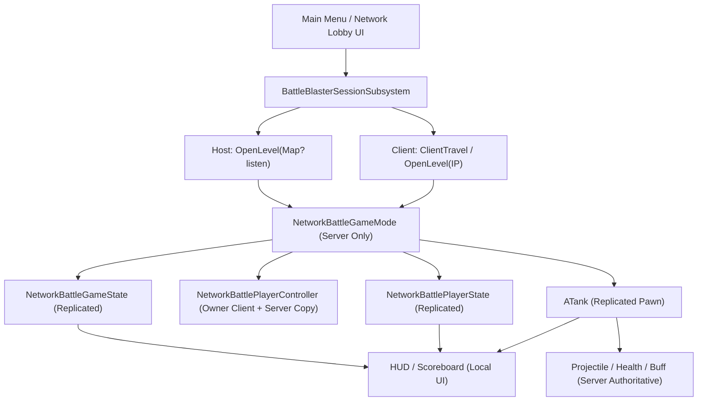

# BattleBlaster 联网模式开发者文档

> 版本：2026-05-17  
> 目标：说明 BattleBlaster 后续开发联网模式时的模块架构、数据归属、服务器权威规则、迁移步骤和当前代码风险点。  
> 范围：先以局域网 Listen Server 为第一阶段目标，后续再扩展 Dedicated Server、公网访问和内网穿透。

---

## 1. 核心结论

联网模式不要直接硬改现有本地分屏模式。当前 FreeForAll、TeamBattle、MOBA 的很多逻辑默认所有玩家都在同一个进程里，GameMode 可以直接创建 LocalPlayer、直接拿本地 PlayerController、直接创建 UI。这种写法适合本地分屏，但不适合网络。

推荐新增一个独立联网模块：

```text
Source/BattleBlaster/Modes/Network/
├── NetworkBattleGameMode.h/.cpp
├── NetworkBattleGameState.h/.cpp
├── NetworkBattlePlayerState.h/.cpp
├── NetworkBattlePlayerController.h/.cpp
└── UI/
    ├── NetworkLobbyWidget.h/.cpp
    └── NetworkScoreboardWidget.h/.cpp

Source/BattleBlaster/Core/Networking/
├── BattleBlasterSessionSubsystem.h/.cpp
└── BattleBlasterNetworkTypes.h
```

第一版建议只做一个最小联网 FFA 或 2v2 模式，目标是先跑通：

- Host 开启局域网 Listen Server。
- Client 输入 IP 加入。
- 服务器分配 `SlotId` 和 `TeamId`。
- 服务器生成 Tank、Projectile、Buff、可破坏物。
- 客户端只发送输入和请求，不直接决定伤害、死亡、得分。
- `GameState` 和 `PlayerState` 复制给客户端，UI 从复制数据刷新。

---

## 2. 当前项目对联网的基础条件

### 2.1 已经有利于联网的改造

当前项目已经把原来的 `PlayerIndex` 拆成了更清晰的概念：

| 概念 | 当前含义 | 联网模式中的用途 |
| --- | --- | --- |
| `LocalPlayerIndex` | 本机第几个本地玩家/输入设备 | 只用于本地分屏和菜单输入，不参与联网身份判断 |
| `SlotId` | 本局比赛槽位 | 由服务器分配，用于出生点、战绩排序、玩家列表 |
| `TeamId` | 队伍/阵营 ID | 由服务器分配，用于敌我判断、友伤、AI 敌人识别 |
| `CampIndex` | MOBA 阵营语义 | MOBA 可继续保留，并同步到 `TeamId` |

这一步很重要，因为联网游戏不能依赖本机 Controller 的索引来判断玩家身份。客户端上的 `PlayerController 0` 只代表“这台机器自己的控制器”，不是全局玩家 0。

### 2.2 当前还不具备的联网基础

代码里目前基本还没有正式的 UE Replication/RPC 体系。后续需要逐步补上：

- `ATankPlayerState` 里的 `SlotId`、`TeamId`、KDA、死亡状态、弹药等需要复制。
- `ATankGameState` 和各模式 GameState 里的比赛时间、分数、胜负状态需要复制。
- `ATank` 需要启用 Actor 复制和移动复制，或者实现自定义移动同步。
- `UHealthComponent` 需要复制血量/护盾，并用 `OnRep` 刷 UI。
- `UTankBuffComponent` 需要服务器管理 Buff，并复制 Buff 状态给客户端。
- `AProjectile` 应由服务器生成和判定命中，客户端只看复制出来的 projectile 和特效。
- 现有 GameMode 里的本地分屏创建逻辑不能直接搬进联网模式。

---

## 3. 联网模块目标架构

### 3.1 高层结构



### 3.2 类职责

| 类 | 是否存在于客户端 | 主要职责 |
| --- | --- | --- |
| `ANetworkBattleGameMode` | 否，只在服务器 | 玩家加入/离开、分配槽位和队伍、生成 Pawn、伤害结算入口、复活、胜负判断 |
| `ANetworkBattleGameState` | 是，复制 | 比赛状态、倒计时、全局分数、胜者、可公开的房间/比赛信息 |
| `ANetworkBattlePlayerState` | 是，复制 | `SlotId`、`TeamId`、玩家名、坦克选择、KDA、死亡状态、准备状态 |
| `ANetworkBattlePlayerController` | 服务器和所属客户端 | 客户端到服务器的 RPC 桥梁，本地 HUD 管理，Owner-only 数据 |
| `ATank` | 是，复制 | 玩家实际控制的 Pawn，移动、开火入口、当前战斗状态 |
| `AProjectile` | 是，复制 | 服务器生成、服务器命中、客户端显示 |
| `UHealthComponent` | 随 Owner Actor 存在 | 服务器改血量，客户端通过复制刷新 UI |
| `UTankBuffComponent` | 随 Owner Actor 存在 | 服务器添加/移除 Buff，客户端显示 Buff |
| `UBattleBlasterSessionSubsystem` | 每个进程都有 | Host/Join/LAN Search/Travel 等会话入口 |

---

## 4. 数据归属规则

联网最容易乱的地方不是 API，而是“谁拥有数据”。建议严格按下面的规则写。

### 4.1 GameInstance

`UBattleBlasterGameInstance` 适合保存本机临时设置：

- 菜单选择。
- 输入设备信息。
- 本机历史记录。
- 本机想选择的坦克。

但它不是网络同步对象。客户端 GameInstance 里的数据不会自动传给服务器，也不会传给其他客户端。

联网模式里，客户端的选择需要通过 RPC 发给服务器，再由服务器写入 `PlayerState`。

### 4.2 GameMode

`GameMode` 是服务器权威类，只能在服务器上使用。

适合放：

- `PostLogin` / `Logout`。
- 分配 `SlotId` 和 `TeamId`。
- 选择出生点。
- Spawn / Possess Tank。
- 伤害、死亡、复活、胜负判断。
- AI 生成和管理。

不适合放：

- UMG 创建。
- 本地分屏视口处理。
- 客户端 UI 刷新。
- 任何客户端必须直接读取的数据。

联网模式的 UI 不应该依赖 `GetWorld()->GetAuthGameMode()`。

### 4.3 GameState

`GameState` 是全局公开状态，服务器写，客户端读。

适合复制：

- 当前比赛状态：等待、倒计时、进行中、结束。
- 倒计时和比赛时间。
- 队伍分数或玩家分数。
- 胜者。
- 房间当前人数。

不适合放：

- 只属于某个玩家自己的输入。
- 只给某个玩家看的私密 UI 状态。
- 服务器内部用的临时指针数组。

### 4.4 PlayerState

`PlayerState` 是每个玩家的公开同步资料。

适合复制：

- `SlotId`
- `TeamId`
- 玩家名。
- 坦克选择。
- 击杀/死亡/助攻。
- 是否死亡。
- 是否准备。
- 当前分数。

后续应让 `ATankPlayerState` 的这些基础字段支持 `GetLifetimeReplicatedProps`，并根据需要加 `OnRep`。

### 4.5 PlayerController

`PlayerController` 是控制入口。每个客户端只拥有自己的 PlayerController，不能指望客户端能看到所有人的 PlayerController。

适合放：

- 客户端输入。
- 本地 HUD。
- 客户端请求服务器的 RPC。
- 服务器发给所属客户端的 Client RPC。

不适合放：

- 全局玩家列表。
- 队伍判断。
- 其他玩家的公开状态。

全局玩家列表应该从 `GameState->PlayerArray` 和 `PlayerState` 读取。

### 4.6 Pawn / Tank

`ATank` 是会被生成、销毁、复活、Possess 的战斗实体。

适合复制：

- Transform 或自定义移动状态。
- 当前生命/护盾。
- 当前弹药。
- 当前 Buff 简要状态。
- 是否死亡/无敌/穿墙等战斗状态。

不适合长期保存：

- 玩家永久身份。身份应该以 `PlayerState` 为主，Tank 只缓存或转发。

---

## 5. 联网模式生命周期

### 5.1 Host 流程

```text
主菜单点击 Host
-> SessionSubsystem 记录本机 Host 设置
-> OpenLevel(NetworkBattleMap, true, "?listen")
-> 服务器加载地图
-> NetworkBattleGameMode::BeginPlay
-> Host 玩家进入 PostLogin
-> 分配 SlotId / TeamId
-> 写入 PlayerState
-> 等待其他玩家加入或进入 Lobby Ready
```

### 5.2 Join 流程

```text
客户端输入局域网 IP
-> ClientTravel / OpenLevel("192.168.x.x")
-> 连接 Host 的 7777 UDP 端口
-> 服务器触发 PostLogin
-> 服务器分配 SlotId / TeamId
-> 服务器写入 PlayerState
-> 客户端收到复制数据
-> 本地 UI 根据 PlayerState 刷新
```

### 5.3 开始比赛

```text
所有玩家 Ready
-> 服务器切换 MatchState
-> 服务器为每个 PlayerState 选择出生点
-> 服务器 Spawn Tank
-> 服务器 Possess
-> Tank 复制给所有客户端
-> 所属客户端绑定输入和 HUD
```

### 5.4 游戏中

```text
客户端输入移动/开火
-> PlayerController 调 Server RPC
-> 服务器验证
-> 服务器移动 Tank / 生成 Projectile
-> 服务器处理命中、伤害、死亡、得分
-> GameState / PlayerState / Tank 状态复制给客户端
-> 客户端 UI 和表现层更新
```

### 5.5 结束比赛

```text
服务器判定胜负
-> 写入 GameState Winner / MatchStatus
-> 客户端 OnRep 或 UI 轮询显示结算
-> Host 可选择返回大厅/重开/换图
```

---

## 6. 服务器权威规则

联网模式必须坚持这条规则：客户端可以请求，服务器负责决定。

### 6.1 只能服务器决定的事情

- 玩家是否成功加入。
- 玩家 `SlotId`。
- 玩家 `TeamId`。
- 玩家选择的 Tank 是否有效。
- 玩家出生点。
- Pawn 生成和 Possess。
- 子弹生成。
- 子弹是否命中。
- 伤害数值。
- Buff 是否拾取成功。
- 死亡、复活、无敌。
- 分数、胜负。

### 6.2 客户端可以做的事情

- 读取输入。
- 请求移动、转向、开火、选择坦克、Ready。
- 播放本地 UI、音效、镜头震动。
- 根据复制数据显示血条、Buff、分数。

### 6.3 RPC 建议

第一版可以先做这些 RPC：

```cpp
// PlayerController
ServerSetReady(bool bReady);
ServerSelectTank(TSubclassOf<ATank> RequestedTankClass);
ServerMoveInput(float ForwardInput, float TurnInput);
ServerFire();

// Tank 或 PlayerController
ClientShowDeathScreen(float RespawnDelay);
ClientShowHitFeedback();

// GameState / Actor
OnRep_MatchStatus();
OnRep_TeamScores();
OnRep_CurrentHealth();
OnRep_ActiveBuffs();
```

注意：RPC 名字这里只是架构建议，实际实现时可以按 UE 规范加 `UFUNCTION(Server, Reliable)` 或 `UFUNCTION(Server, Unreliable)`。

移动输入通常适合 `Unreliable`，Ready、选择坦克、开火、复活请求通常适合 `Reliable` 或按具体手感调整。

---

## 7. 移动同步方案

你的 `ATank` 当前使用 `UFloatingPawnMovement` 加自定义移动逻辑。联网第一版建议不要立刻做复杂预测，先做服务器权威移动。

### 7.1 第一阶段：简单服务器权威

```text
客户端采集输入
-> ServerMoveInput
-> 服务器调用 Tank 移动逻辑
-> Tank 开启 Replicate Movement
-> 客户端收到服务器位置
```

优点：

- 实现简单。
- 不容易被客户端作弊。
- 适合先验证联机流程。

缺点：

- 延迟明显时手感会钝。
- 局域网基本可接受，公网需要后续优化。

### 7.2 第二阶段：客户端预测

当第一阶段稳定后，再考虑：

- 客户端先本地移动。
- 输入带序号发给服务器。
- 服务器回传权威位置。
- 客户端回滚/校正。
- 远端玩家使用插值平滑。

这一步复杂度较高，不建议第一版就做。

---

## 8. 战斗同步方案

### 8.1 开火

当前 `ATank::Fire()` 本地会扣弹药、生成 Projectile、刷新 HUD。联网模式需要拆成三层：

```text
客户端按下开火
-> 本地可先播放轻量反馈
-> ServerFire
-> 服务器检查冷却、弹药、死亡状态、比赛状态
-> 服务器扣弹药
-> 服务器 Spawn Projectile
-> Projectile 复制给客户端
-> PlayerState/Tank 弹药复制后刷新 HUD
```

### 8.2 Projectile

`AProjectile` 在联网模式中应遵守：

- 服务器生成。
- 服务器绑定命中。
- 服务器调用 `ApplyDamage`。
- 客户端只负责显示运动、特效、音效。
- 炮弹相撞抵消是游戏特色，保留 Projectile 通道互相 Block。

### 8.3 伤害

伤害入口应统一经过服务器。

推荐规则：

```text
Projectile::OnHit only authority
-> 找到 AttackerTank / VictimTank
-> 用 TeamId 判断友伤
-> ApplyDamage
-> HealthComponent 改血量
-> Tank / PlayerState 处理死亡
-> GameMode 处理得分和复活
```

### 8.4 Buff

Buff 第一版建议服务器独占修改权限：

- `BuffPickup` 由服务器判断是否可拾取。
- `TankBuffComponent::AddBuff` 只在服务器生效。
- `ActiveBuffs` 或压缩后的 Buff 状态复制给客户端。
- 客户端 UI 只显示复制结果。

穿墙、子弹穿透、Ghost Mode 这类会影响碰撞和命中的 Buff，必须由服务器最终决定。客户端显示可以提前，但不能改变权威判定。

---

## 9. UI 架构

### 9.1 联网 UI 的读取来源

| UI | 数据来源 |
| --- | --- |
| 自己的血量/护盾 | 自己 Pawn 的 `UHealthComponent` 复制值 |
| 自己的弹药 | 自己 Tank 或 PlayerState 的复制值 |
| 自己的 Buff | 自己 BuffComponent 的复制值 |
| KDA | 自己 PlayerState |
| 计分板 | GameState + PlayerArray |
| 队伍颜色 | 自己 PlayerState 的 `TeamId` |
| 结算界面 | GameState 的胜负状态 |

### 9.2 联网 UI 禁忌

联网模式 UI 不要这样写：

```cpp
GetWorld()->GetAuthGameMode()
UGameplayStatics::GetPlayerController(World, 0)
GetWorld()->GetFirstPlayerController()
```

例外：本地菜单或纯单机模式可以使用。联网对局内，应优先用：

```cpp
GetOwningPlayer()
GetOwningPlayerState()
GetWorld()->GetGameState()
GameState->PlayerArray
```

### 9.3 现有 UI 迁移重点

当前 `ATankPlayerController::InitializeHUD()` 里有根据 `LocalPlayerIndex` 设置 KDA 颜色的逻辑。联网模式应该改成根据 `PlayerState->TeamId` 或 `SlotId` 设置颜色。

结算界面、计分板、MOBA 顶部状态 UI，也应该从 `GameState` / `PlayerState` 读取复制数据，不要依赖本地数组。

---

## 10. AI 架构

联网模式里 AI 应只在服务器运行。

规则：

- AIController 只由服务器生成。
- AI Pawn 由服务器 Possess。
- AI 的移动、开火、目标选择只在服务器执行。
- AI 的 Tank 和状态复制给所有客户端。
- 如果 AI 需要 KDA，应确保 AIController 有 PlayerState，或者用独立的 BotState 数据结构。

当前 `AAIBotPlayerController` 已经用 `TeamId` 判断敌我，这对联网是好基础。

---

## 11. 会话与网络入口

第一版可以不接 OnlineSubsystem，先做最简单 IP 联机。

### 11.1 Host

```cpp
UGameplayStatics::OpenLevel(World, FName("NetworkBattleMap"), true, "listen");
```

或者构造：

```text
NetworkBattleMap?listen
```

### 11.2 Join

```cpp
APlayerController* PC = UGameplayStatics::GetPlayerController(World, 0);
PC->ClientTravel("192.168.1.20:7777", TRAVEL_Absolute);
```

### 11.3 LAN Search

第二阶段再做 LAN 房间搜索。可以考虑：

- UE OnlineSubsystem Null。
- SessionSubsystem 封装 CreateSession / FindSessions / JoinSession。
- 或者第一版继续手动输入 IP，先把核心战斗跑通。

---

## 12. 公网和内网穿透规划

### 12.1 云服务器用途

2 核 2G 云服务器可以承担：

- 小规模 Dedicated Server。
- 房间列表服务。
- 登录/匹配服务。
- UDP 转发或内网穿透入口。

但它不适合承载大规模高频物理同步，也不适合同时开很多 UE Dedicated Server 实例。

### 12.2 高性能内网主机用途

高性能内网主机可以用于：

- 开发测试服务器。
- 少量 Dedicated Server 实例。
- 自动化构建。
- 录像、AI、工具服务。

普通 UE Dedicated Server 通常不需要显卡，RTX 5090 对常规服务器逻辑帮助不大。

### 12.3 内网穿透注意点

Unreal 实时游戏主要依赖 UDP。内网穿透方案必须支持 UDP 转发。

只支持 TCP 的穿透方案通常不适合实时对战。即使能连上，也可能出现延迟、丢包、抖动、命中不同步等问题。

---

## 13. 分阶段开发计划

### 阶段 0：代码审计和边界确认

目标：列出本地分屏依赖点。

重点检查：

- `CreatePlayer` / `RemovePlayer`
- `GetNumLocalPlayerControllers`
- `GetPlayerController(World, Index)`
- `GetFirstPlayerController`
- `GetAuthGameMode`
- 直接在 GameMode 创建 UI
- GameInstance 里只存在本机的数据
- 未复制的状态字段

### 阶段 1：最小 Host / Join

目标：局域网连接成功。

内容：

- 新建 `BattleBlasterSessionSubsystem`。
- 主菜单加 Host / Join IP 入口。
- Host 打开 `NetworkBattleMap?listen`。
- Client 输入 IP 加入。
- `NetworkBattleGameMode::PostLogin` 打日志。

验收：

- 两台电脑能连接到同一张地图。
- Host 能看到 Client 加入日志。

### 阶段 2：服务器分配身份和生成 Tank

目标：服务器给玩家分配身份并生成 Pawn。

内容：

- 新建 `NetworkBattlePlayerState`。
- 复制 `SlotId`、`TeamId`、Ready、TankClass。
- `PostLogin` 分配槽位。
- 服务器 Spawn Tank 并 Possess。
- Tank 开启复制。

验收：

- 两个客户端都能看到彼此的 Tank。
- 每个玩家的 `SlotId`、`TeamId` 正确。

### 阶段 3：移动同步

目标：玩家能在网络中移动。

内容：

- Tank `bReplicates = true`。
- Tank `SetReplicateMovement(true)`。
- 客户端输入通过 Server RPC 发给服务器。
- 服务器执行移动。

验收：

- A 机器移动，B 机器能看到。
- B 机器移动，A 机器能看到。

### 阶段 4：开火、伤害、死亡、复活

目标：完整战斗闭环。

内容：

- `ServerFire`。
- 服务器生成 `AProjectile`。
- Projectile 服务器命中。
- HealthComponent 复制生命/护盾。
- PlayerState 复制 KDA。
- GameMode 处理复活。

验收：

- 子弹能被所有客户端看到。
- 命中只由服务器判定。
- KDA、分数、死亡、复活一致。

### 阶段 5：Lobby 和选坦克

目标：进入战斗前可选坦克和 Ready。

内容：

- Network Lobby UI。
- Client 选择 Tank 后调用 `ServerSelectTank`。
- 服务器验证 TankClass 白名单。
- PlayerState 复制选择结果。
- 所有人 Ready 后开始。

验收：

- 每个人能看到所有人的选择和 Ready 状态。
- 服务器开始比赛时使用正确 TankClass。

### 阶段 6：LAN Session 和公网方案

目标：从“手动 IP”升级到更完整的联机入口。

内容：

- OnlineSubsystem Null LAN 搜索。
- Dedicated Server 目标。
- 云服务器部署测试。
- UDP 内网穿透测试。

验收：

- 局域网房间可搜索。
- Dedicated Server 可启动。
- 外网连接方案经过延迟/丢包测试。

---

## 14. 当前代码风险点清单

### 14.1 本地分屏强耦合

这些模式当前会主动创建/删除本地玩家：

- `ABattleBlasterGameMode`
- `ATeamBattleGameMode`
- `ATankMOBAGameMode`
- 部分菜单 Widget

联网模式不能在 GameMode 里用本地玩家数量决定全局玩家数量。玩家数量应来自服务器连接数量和 PlayerState 列表。

### 14.2 GameMode 创建 UI

现有模式里有不少 GameMode 直接创建比分、黑屏、结算 UI 的逻辑。这在本地分屏没问题，但 Dedicated Server 没有本地 viewport，联网模式应把 UI 创建放到 PlayerController 或 Widget 自己的生命周期里。

### 14.3 GameInstance 数据不会自动同步

`SelectedTankClasses`、`TargetPlayerCount`、`TargetMatchScore` 当前适合作为本机菜单设置，但联网模式里服务器才是最终来源。

客户端想选择坦克时，应：

```text
本地菜单选择
-> ServerSelectTank
-> 服务器验证
-> 写入 PlayerState
-> PlayerState 复制给所有客户端
```

### 14.4 Health / Buff / KDA 尚未复制

当前这些数据可以在本地分屏里直接访问，但联网里必须复制：

- `UHealthComponent::CurrentHealth`
- `UHealthComponent::CurrentShield`
- `ATankPlayerState::KillCount`
- `ATankPlayerState::DeathCount`
- `ATankPlayerState::AssistCount`
- `ATankPlayerState::SlotId`
- `ATankPlayerState::TeamId`
- Buff 列表或 Buff 标记

### 14.5 开火和子弹需要服务器化

当前 `ATank::Fire()` 是本地玩法函数。联网模式不能让客户端自己 Spawn 子弹并决定命中。

建议新增网络专用入口：

```text
Input Fire
-> if local network mode: ServerFire
-> server calls authoritative fire implementation
```

后续可以把本地分屏和联网共用的开火实现抽成内部函数，例如：

```cpp
bool CanFire() const;
void ConsumeAmmoForFire();
void SpawnProjectilesAuthority();
void PlayFireFeedbackLocal();
```

---

## 15. Unreal 编辑器和测试建议

### 15.1 PIE 测试

推荐设置：

- Number of Players：2 或 3。
- Net Mode：Play As Listen Server。
- Run Under One Process：前期可开，发现问题后建议关闭再测。
- Dedicated Server：第二阶段以后再测。

### 15.2 网络模拟

用控制台命令模拟延迟和丢包：

```text
Net PktLag=80
Net PktLoss=2
Net PktLagVariance=20
```

恢复：

```text
Net PktLag=0
Net PktLoss=0
Net PktLagVariance=0
```

### 15.3 局域网真机测试

检查项：

- Windows 防火墙允许 UE 编辑器/打包游戏通过。
- 默认 UDP 端口通常是 7777。
- Host 和 Client 在同一网段。
- Client 使用 Host 的局域网 IP，例如 `192.168.1.x:7777`。

---

## 16. 推荐的第一版验收标准

第一版联网模式只要做到下面这些，就算架构打通：

- Host 能开启局域网房间。
- Client 能输入 IP 加入。
- 服务器能给每个玩家分配 `SlotId` 和 `TeamId`。
- 每个玩家能看到所有 Tank。
- 每个玩家能移动，并被其他玩家看到。
- 每个玩家能开火。
- 子弹由服务器生成。
- 命中、扣血、死亡、复活由服务器处理。
- KDA 和分数通过 PlayerState/GameState 同步。
- UI 不依赖本地玩家 0。

暂时不要求：

- 客户端预测。
- 复杂大厅。
- 好看的房间列表。
- 公网穿透。
- MOBA 全量迁移。
- Dedicated Server 部署。

先把最小闭环跑通，后续再逐个把现有玩法搬进去。

---

## 17. 后续实现顺序建议

最稳的开发顺序如下：

1. 新建 `Modes/Network` 目录和四个核心类：GameMode、GameState、PlayerState、PlayerController。
2. 新建 `Core/Networking/BattleBlasterSessionSubsystem`，只实现 Host/Join IP。
3. 做 `PostLogin` 分配 `SlotId`、`TeamId`，先只打日志。
4. 让 `NetworkBattlePlayerState` 复制身份字段。
5. 服务器 Spawn 一个默认 Tank，并 Possess。
6. 开启 Tank 复制和移动复制。
7. 改造网络模式下的输入和移动 RPC。
8. 改造网络模式下的开火 RPC。
9. 让 Projectile、Health、KDA、Score 复制。
10. 做最简 Lobby 和 Ready。
11. 再考虑 LAN 搜索和公网联机。

这条路线的核心思想是：不要先追求完整玩法，而是先让“连接、生成、移动、开火、死亡、同步”这条主链路稳定。
