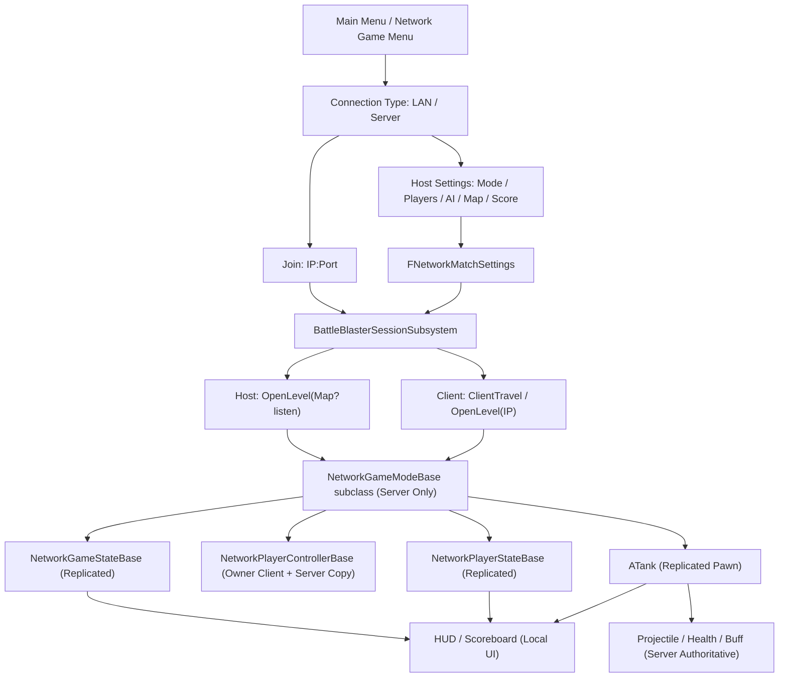

# BattleBlaster 联网模式开发者文档

> 版本：2026-06-05
> 目标：说明 BattleBlaster 后续开发联网模式时的模块架构、数据归属、服务器权威规则、迁移步骤和当前代码风险点。
> 范围：先以局域网 Listen Server 为第一阶段目标，后续再扩展 Dedicated Server、公网访问和内网穿透。

---

## 1. 核心结论

联网模式不要直接硬改现有本地分屏模式。当前 FreeForAll、TeamBattle、MOBA 的很多逻辑默认所有玩家都在同一个进程里，GameMode 可以直接创建 LocalPlayer、直接拿本地 PlayerController、直接创建 UI。这种写法适合本地分屏，但不适合网络。

推荐新增一个独立联网模块：

```text
Source/BattleBlaster/Modes/Network/
├── NetworkGameModeBase.h/.cpp
├── NetworkGameStateBase.h/.cpp
├── NetworkPlayerStateBase.h/.cpp
├── NetworkPlayerControllerBase.h/.cpp
├── NetworkDeathmatchGameMode.h/.cpp
├── NetworkDeathmatchGameState.h/.cpp
├── NetworkTeamDeathmatchGameMode.h/.cpp
├── NetworkTeamDeathmatchGameState.h/.cpp
├── NetworkMOBAGameMode.h/.cpp
├── NetworkMOBAGameState.h/.cpp
├── NetworkTeamMOBAGameMode.h/.cpp
└── UI/
    ├── CppShowScoresWidget.h/.cpp
    ├── NetworkTeamScoresWidget.h/.cpp
    ├── NetworkMOBAStateWidget.h/.cpp
    ├── NetworkDeathmatchGameOverWidget.h/.cpp
    └── Menu/
        ├── NetworkMenuWidgetBase.h/.cpp
        ├── NetworkModeSelectWidget.h/.cpp
        ├── LANMenuWidget.h/.cpp
        ├── LANHostSettingsWidget.h/.cpp
        ├── NetworkMapSelectWidget.h/.cpp
        └── LANJoinWidget.h/.cpp

Source/BattleBlaster/Core/Networking/
├── BattleBlasterSessionSubsystem.h/.cpp
└── BattleBlasterNetworkTypes.h
```

### 1.1 未来网络入口宏观架构

网络菜单建议按“连接方式”和“玩法模式”分层，不要把局域网死斗、服务器死斗、局域网 MOBA、服务器 MOBA 写成四套互相独立的玩法代码。

目标入口流程：

```text
主菜单
-> 网络游戏菜单
   -> 局域网游戏
      -> 加入：输入 IP:Port
      -> 主持：进入游戏设置页
   -> 服务器游戏
      -> 加入：输入 IP:Port，后续可扩展服务器列表
      -> 主持：进入游戏设置页，后续可扩展 Dedicated Server / 内网穿透配置

游戏设置页
-> 选择游戏模式：多人死斗 / 团队死斗 / MOBA / 团队 MOBA
-> 选择玩家人数、AI 玩家数、地图、目标分数等
-> HostNetworkGame(Settings)
```

推荐分成三层：

```text
连接层
├── LAN
│   ├── Host: OpenLevel(Map?listen)
│   └── Join: ClientTravel(IP:Port)
└── Server
    ├── Host: Dedicated Server / 公网云服务器 / 内网穿透主机
    └── Join: 公网 IP:Port / 后续服务器列表

房间设置层
└── FNetworkMatchSettings
    ├── ConnectionType: LAN / DedicatedServer
    ├── ModeType: Deathmatch / TeamDeathmatch / MOBA / TeamMOBA
    ├── MapName
    ├── Port
    ├── MaxPlayers
    ├── AICount
    ├── TargetScore
    └── TeamCount

玩法模式层
└── ANetworkGameModeBase
    ├── ANetworkDeathmatchGameMode
    ├── ANetworkTeamDeathmatchGameMode
    ├── ANetworkMOBAGameMode
    └── ANetworkTeamMOBAGameMode
```

关键原则：

- LAN 和 Server 只是连接、发现、部署方式不同，不应该拥有两套死斗或 MOBA 玩法代码。
- 多人死斗、团队死斗、MOBA、团队 MOBA 应该是 `ANetworkGameModeBase` 的不同子类。
- UMG 蓝图负责绘制菜单、收集输入和调用 C++ 暴露的 `BlueprintCallable` 接口。
- C++ 负责保存设置、校验设置、选择地图、选择 GameMode、Host / Join / Travel。
- `GameInstance` 或 `GameInstanceSubsystem` 可以保存本机菜单临时设置，但进入对局后服务器才是权威来源。
- 进入地图后，服务器应从 URL Options、Subsystem 或未来 Lobby 数据读取 `FNetworkMatchSettings`，再写入 `GameMode` / `GameState` / `PlayerState`。
- 不要在 `ANetworkGameModeBase` 里写菜单 UI、IP 输入、服务器列表、LAN 搜索 UI 或主菜单跳转细节。

当前代码已经落地了第一版结构化入口：`FNetworkMatchSettings` 定义在 `BattleBlasterNetworkTypes.h`，`UBattleBlasterSessionSubsystem::HostNetworkGame()` 负责根据设置选择具体网络 GameMode 并构造 URL Options，`JoinNetworkGame()` 负责 IP:Port 直连。UMG 蓝图或 C++ 菜单只需要收集输入并传入设置，不应该自己拼接裸 URL 字符串。

`MaxPlayers` 表示本局总槽位数，`AICount` 表示其中由服务器 AI 填充的槽位数，不是额外追加人数。例如 `MaxPlayers=4, AICount=2` 表示总共 4 个槽位，其中最多 2 个真人槽位和 2 个 AI 槽位。当前实现中真人优先占用靠前 Slot，AI 占用末尾 Slot。

### 1.2 Dedicated Server 兼容约束

项目后续要同时支持两种运行方式：

```text
Listen Server
-> 某个玩家客户端同时承担服务器职责
-> 适合局域网、内网穿透、小范围测试

Dedicated Server
-> 独立服务器进程只跑权威规则，不渲染画面，也没有本地玩家 UI
-> 适合真正的服务器游戏、公网房间、长期运行
```

两者运行形态不同，但网络玩法代码应按 Dedicated Server 标准写。原因是：Listen Server 只是比 Dedicated Server 多了一个同进程的本地客户端；服务器规则不应该依赖这个本地客户端存在。

因此 `Modes/Network` 下的所有对局内代码必须遵守：

- `GameMode` 不创建 UMG，不访问 Viewport，不播放本地 UI 动画。
- `GameMode` 不使用 `GetFirstPlayerController()` 或 `GetPlayerController(0)` 代表房主或全局玩家。
- `GameMode` 不依赖本机 `GameInstance` 的菜单状态推进规则；对局参数应来自 URL Options、服务器配置、Subsystem 或未来 Lobby 数据。
- 公共状态写入 `GameState` / `PlayerState` / 复制 Actor。
- 私有 UI 和输入逻辑放在 owning `PlayerController` 或 Widget。
- 服务器逻辑用 `HasAuthority()` 判断，本地 UI / 输入用 `IsLocalController()` 或 `IsLocallyControlled()` 判断。
- 网络玩法子类不能假设服务器上存在本地玩家、手柄、音频设备或屏幕。

如果代码满足 Dedicated Server 要求，它通常也能在 Listen Server 上运行；反过来，只在 Listen Server 上能工作的代码不一定能在 Dedicated Server 上工作。

当前第一版联网链路已经从“只跑通连接”推进到“可选择多种网络玩法原型”。后续仍要继续按同一套服务器权威原则完善，而不是回头复制本地分屏 GameMode。

已经具备的联网基础能力：

- Host 开启局域网 Listen Server。
- Client 输入 IP:Port 加入。
- Host 设置页可选择 Deathmatch / TeamDeathmatch / MOBA / TeamMOBA，并通过 URL Options 切换 GameMode。
- 服务器分配 `SlotId` 和 `TeamId`。
- 服务器生成 Tank、Projectile、Buff、可破坏物。
- 客户端发送输入和请求，服务器决定移动、开火、伤害、死亡、得分和淘汰。
- `GameState` 和 `PlayerState` 复制给客户端，UI 从复制数据刷新。

---

## 2. 当前项目对联网的基础条件

### 2.1 已经有利于联网的改造

当前项目已经把原来的 `PlayerIndex` 拆成了更清晰的概念：

| 概念 | 当前含义 | 联网模式中的用途 |
| --- | --- | --- |
| `LocalPlayerIndex` | 本机第几个本地玩家/输入设备 | 只用于本地分屏和菜单输入，不参与联网身份判断 |
| `SlotId` | 本局比赛槽位 | 由服务器分配，用于出生点、战绩排序、玩家列表 |
| `TeamId` | 队伍/阵营 ID | 由服务器分配，用于敌我判断、友伤、AI 敌人识别 |
| `CampIndex` | MOBA 阵营语义 | MOBA 可继续保留，并同步到 `TeamId` |

这一步很重要，因为联网游戏不能依赖本机 Controller 的索引来判断玩家身份。客户端上的 `PlayerController 0` 只代表“这台机器自己的控制器”，不是全局玩家 0。

### 2.2 当前已经落地的联网基础

截至 2026-06-05，项目已经不再是“完全没有网络层”的状态。当前最小网络战斗链路已经具备：

- `Modes/Network` 已有 `NetworkGameModeBase`、`NetworkGameStateBase`、`NetworkPlayerStateBase`、`NetworkPlayerControllerBase`。
- `Core/Networking` 已有 `BattleBlasterSessionSubsystem`，用于 Host / Join 入口。
- `ATankPlayerState` 已复制 `SlotId`、`TeamId`、`IsAlive`、`CurrentAmmo`、KDA。
- `ANetworkPlayerStateBase` 已复制 `bIsReady`。
- `ANetworkGameStateBase` 已复制连接人数和最大玩家数。
- `ATank` 已具备网络模式下的移动、转向、炮塔转向和开火 RPC。
- `AProjectile` 已开启 Actor / Movement 复制，服务器负责命中与伤害。
- `UHealthComponent` 已复制生命和护盾。
- `UTankBuffComponent` 已复制用于 UI 显示的 Buff 列表。
- `ABuffPickup` 已复制刷出的 Buff 类型和可拾取状态。
- `ADestructibleProp` 已复制破坏状态和可推动物体的 Mesh Transform。
- `ASpikeTrap` 已复制状态机和服务端状态开始时间，客户端自行播放插值动画。
- `ATower` 已复制死亡状态和炮塔朝向。
- `ANetworkDeathmatchGameMode` / `ANetworkDeathmatchGameState` 已实现个人死斗分数、目标分、胜者和结算入口。
- `ANetworkTeamDeathmatchGameMode` / `ANetworkTeamDeathmatchGameState` 已实现团队分配、友伤过滤、团队分数和团队胜负。
- `ANetworkMOBAGameMode` / `ANetworkMOBAGameState` 已实现核心塔存活计数、队伍淘汰、胜利队伍和 MOBA 状态同步。
- `ANetworkTeamMOBAGameMode` 已复用网络 MOBA 规则，并按队伍分配玩家。
- `ANetworkPlayerControllerBase` 已能根据当前 GameState 自动创建个人死斗、团队死斗或 MOBA 顶部状态 UI。

仍然要注意：旧的 FreeForAll、TeamBattle、MOBA 依然是本地分屏模式，不能直接当作网络模式使用。联网模式应该继续放在独立 `Modes/Network` 下，逐步复用共享类。

---

## 3. 联网模块目标架构

### 3.1 高层结构



### 3.2 类职责

| 类 | 是否存在于客户端 | 主要职责 |
| --- | --- | --- |
| `ANetworkGameModeBase` | 否，只在服务器 | 网络战斗基类：玩家加入/离开、分配槽位和基础队伍、生成 Pawn、死亡入口、复活、通用网络战斗流程 |
| `ANetworkGameStateBase` | 是，复制 | 比赛状态、倒计时、全局分数、胜者、可公开的房间/比赛信息 |
| `ANetworkPlayerStateBase` | 是，复制 | `SlotId`、`TeamId`、玩家名、坦克选择、KDA、死亡状态、准备状态 |
| `ANetworkPlayerControllerBase` | 服务器和所属客户端 | 客户端到服务器的 RPC 桥梁，本地 HUD 管理，Owner-only 数据 |
| `ATank` | 是，复制 | 玩家实际控制的 Pawn，移动、开火入口、当前战斗状态 |
| `AProjectile` | 是，复制 | 服务器生成、服务器命中、客户端显示 |
| `UHealthComponent` | 随 Owner Actor 存在 | 服务器改血量，客户端通过复制刷新 UI |
| `UTankBuffComponent` | 随 Owner Actor 存在 | 服务器添加/移除 Buff，客户端显示 Buff |
| `UBattleBlasterSessionSubsystem` | 每个进程都有 | Host/Join/LAN Search/Travel 等会话入口 |

### 3.3 网络玩法模式继承结构

`ANetworkGameModeBase` 当前没有写死具体玩法规则，更适合作为所有网络战斗模式的公共基类，而不是“网络死斗模式本身”。

推荐继承结构：

```text
ANetworkGameModeBase
├── ANetworkDeathmatchGameMode
├── ANetworkTeamDeathmatchGameMode
├── ANetworkMOBAGameMode
└── ANetworkTeamMOBAGameMode
```

`ANetworkGameModeBase` 应保持“流程基类”定位，主要负责：

- 连接进入和离开：`PostLogin()`、`Logout()`、`HandleStartingNewPlayer_Implementation()`。
- 玩家身份：分配 `SlotId`、写入基础 `TeamId`、刷新连接人数。
- Pawn 生命周期：选择出生点、Spawn Tank、Possess、初始化生命和弹药、绑定死亡事件。
- 通用死亡入口：收到 `OnKilled` 后标记死亡、显示死亡倒计时、安排复活。
- 网络 UI 入口：只调用 PlayerController 的 owner-only 方法或 Client RPC，不直接创建 UMG。

具体网络玩法子类负责：

- 死斗：击杀加分、自杀或环境死亡扣分、目标分胜利、个人排行榜。
- 团队死斗：队伍分配、友伤过滤、团队分数、团队胜负。
- MOBA：阵营分配、Tower / Turret 规则、核心塔被摧毁后的淘汰规则、复活条件、最终胜负。

为了让子类更干净，基类已经提供了这些可覆盖钩子：

```cpp
virtual int32 ChooseTeamIdForSlot(int32 SlotId) const;
virtual bool UsesTeamDamageRules() const;
virtual bool AreTeamIdsHostile(int32 AttackerTeamId, int32 VictimTeamId) const;
virtual bool CanTankDamageTank(const ATank* AttackerTank, const ATank* VictimTank) const;
virtual bool ShouldRespawnPlayer(ANetworkPlayerStateBase* PlayerState) const;
virtual void HandleNetworkTankKilled(ATank* DeadTank, ATank* KillerTank);
virtual void CheckNetworkGameOver();
```

默认行为保持最小网络战斗链路不变：`ChooseTeamIdForSlot()` 返回 `SlotId`，`ShouldRespawnPlayer()` 默认允许复活，`HandleNetworkTankKilled()` 只处理死亡 UI 和复活调度，`CheckNetworkGameOver()` 默认为空。

原则：基类负责“网络对局怎么运转”，子类负责“这个模式怎么算赢、怎么算分、能不能复活、谁能打谁”。

### 3.4 网络多人死斗

`ANetworkDeathmatchGameMode` 是第一套具体网络玩法模式，继承 `ANetworkGameModeBase`。

职责：

- 复用 `ANetworkGameModeBase` 的连接、分配、生成、死亡和复活流程。
- 复用 `ATankPlayerState::ProcessDeath()` 的 KDA 与仇人队列结算。
- 只处理死斗“比赛积分”：玩家击杀加 1 分，无有效击杀者时死者扣 1 分且不低于 0。
- 达到 `TargetScore` 后把胜者槽位写入 `ANetworkDeathmatchGameState::WinnerSlotId`。
- 比赛结束后不再安排玩家复活。

`ANetworkDeathmatchGameState` 负责复制死斗公共状态：

- `PlayerScores`
- `TargetScore`
- `WinnerSlotId`

`PlayerScores`、`TargetScore`、`WinnerSlotId` 使用复制回调触发 `OnScoreStateChanged`，让本地 UI 在数据变化时刷新。Host / Listen Server 的本地 UI 不依赖 `OnRep`，服务器改分数时也会主动广播一次。

`ANetworkPlayerControllerBase` 负责创建网络比分 UI。它暴露 `ScoresWidgetClass`，默认使用 `UCppShowScoresWidget`。创建后它会读取 `ANetworkDeathmatchGameState`，显示目标分、比赛时间、各玩家分数进度条，并高亮本地玩家。

网络死斗结算 UI 使用 `UNetworkDeathmatchGameOverWidget`。它不复用本地分屏的 `UMultiBattleGameOverWidget`，原因是本地分屏结算界面会读取 `GameInstance` 和 `ATankBattlePlayerState`，这些数据来源不适合网络模式。网络结算界面从 `ANetworkDeathmatchGameState` 和复制后的 `ATankPlayerState` 读取胜者、比分和 KDA。

`ANetworkPlayerControllerBase` 暴露 `DeathmatchGameOverWidgetClass`。当 `WinnerSlotId` 复制到客户端后，本地 PlayerController 创建该 Widget，并切到 UI 输入模式。GameMode 不直接创建 UMG。

如果 `DeathmatchGameOverWidgetClass` 未设置，`ANetworkPlayerControllerBase` 会直接创建 `UNetworkDeathmatchGameOverWidget`。该类在没有蓝图绑定控件时会生成一个 C++ 默认调试界面，用于显示胜者、各玩家 KDA 和临时评分。正式 UI 完成后，只需要创建继承自 `UNetworkDeathmatchGameOverWidget` 的 UMG 蓝图并挂回 `DeathmatchGameOverWidgetClass`。

编辑器中建议新建 `BP_NetworkDeathmatchGameMode`，父类选择 `ANetworkDeathmatchGameMode`，然后在网络死斗地图中把 GameMode Override 指向该蓝图。

### 3.5 网络团队死斗

`ANetworkTeamDeathmatchGameMode` 继承 `ANetworkGameModeBase`，用于网络团队死斗。

职责：

- 覆盖 `ChooseTeamIdForSlot()`，当前按 `SlotId % TeamCount` 分配队伍。
- 覆盖 `UsesTeamDamageRules()`，让 `AProjectile` 通过 `CanTankDamageTank()` 过滤友伤。
- 处理团队击杀加分、无有效击杀者时扣本队分数。
- 达到 `TargetScore` 后把胜利队伍写入 `ANetworkTeamDeathmatchGameState::WinningTeamId`。
- 比赛结束后禁用仍存活 Tank 的输入。

`ANetworkTeamDeathmatchGameState` 负责复制：

- `TeamScores`
- `WinningTeamId`
- 继承自 `ANetworkDeathmatchGameState` 的 `TargetScore`、`MatchElapsedSeconds`、`bIsMatchOver`

`ANetworkPlayerControllerBase` 会优先识别 `ANetworkTeamDeathmatchGameState`，创建 `TeamScoresWidgetClass`。默认 C++ UI 为 `UNetworkTeamScoresWidget`，显示目标分、时间、每个队伍的分数进度条，并高亮本地玩家所在队伍。

### 3.6 网络 MOBA 与团队 MOBA

`ANetworkMOBAGameMode` 继承 `ANetworkGameModeBase`，用于网络 MOBA。`ANetworkTeamMOBAGameMode` 继承 `ANetworkMOBAGameMode`，只改变 TeamId 分配方式，用于团队 MOBA。

职责：

- 覆盖 `ChooseTeamIdForSlot()`：个人 MOBA 默认 `TeamId = SlotId`，团队 MOBA 默认 `TeamId = SlotId % TeamCount`。
- 覆盖 `UsesTeamDamageRules()`，让炮弹、Turret、TurretProjectile 使用同一套 TeamId 敌我规则。
- 提供 `RegisterCoreForTeam(int32)` 和 `NotifyCoreDestroyedForTeam(int32)`，由核心 `ATurret` 在 BeginPlay / HandleDestruction 中通知网络 MOBA GameMode。
- 核心塔被摧毁不会立刻结束游戏；该队玩家后续再次死亡时才无法复活并进入淘汰。
- 只剩一个未淘汰队伍时写入胜利队伍并结束比赛。

`ANetworkMOBAGameState` 负责复制：

- `AliveCoreCountsByTeam`
- `bTeamEliminated`
- `WinningTeamId`
- `MatchElapsedSeconds`
- `MOBAStateRevision`

`ANetworkPlayerControllerBase` 识别到 `ANetworkMOBAGameState` 后，会创建 `MOBAStateWidgetClass`。默认 C++ UI 为 `UNetworkMOBAStateWidget`，显示每个队伍的核心塔数量，以及 `ALIVE`、`CORE DOWN`、`ELIMINATED` 状态，并高亮本地玩家所在队伍。

网络 MOBA 地图需要保证核心 `ATurret` 的 `CampIndex` 与网络 `TeamId` 对齐。否则核心塔注册到了错误队伍，就会导致复活/淘汰判断错误。

---

## 4. 数据归属规则

联网最容易乱的地方不是 API，而是“谁拥有数据”。建议严格按下面的规则写。

### 4.1 GameInstance

`UBattleBlasterGameInstance` 适合保存本机临时设置：

- 菜单选择。
- 输入设备信息。
- 本机历史记录。
- 本机想选择的坦克。

但它不是网络同步对象。客户端 GameInstance 里的数据不会自动传给服务器，也不会传给其他客户端。

联网模式里，客户端的选择需要通过 RPC 发给服务器，再由服务器写入 `PlayerState`。

### 4.2 GameMode

在网络模块里，`ANetworkGameModeBase` 应被视为网络战斗基类。不要把某一种具体玩法的计分或胜负规则直接写死在这个类里；需要做网络死斗、网络 MOBA、网络团队战时，新建子类并覆盖规则钩子。

`GameMode` 是服务器权威类，只能在服务器上使用。

适合放：

- `PostLogin` / `Logout`。
- 分配 `SlotId` 和 `TeamId`。
- 选择出生点。
- Spawn / Possess Tank。
- 伤害、死亡、复活、胜负判断。
- AI 生成和管理。

不适合放：

- UMG 创建。
- 本地分屏视口处理。
- 客户端 UI 刷新。
- 任何客户端必须直接读取的数据。

联网模式的 UI 不应该依赖 `GetWorld()->GetAuthGameMode()`。

### 4.3 GameState

`GameState` 是全局公开状态，服务器写，客户端读。

适合复制：

- 当前比赛状态：等待、倒计时、进行中、结束。
- 倒计时和比赛时间。
- 队伍分数或玩家分数。
- 胜者。
- 房间当前人数。

不适合放：

- 只属于某个玩家自己的输入。
- 只给某个玩家看的私密 UI 状态。
- 服务器内部用的临时指针数组。

### 4.4 PlayerState

`PlayerState` 是每个玩家的公开同步资料。

适合复制：

- `SlotId`
- `TeamId`
- 玩家名。
- 坦克选择。
- 击杀/死亡/助攻。
- 是否死亡。
- 是否准备。
- 当前分数。

当前 `ATankPlayerState` 已经复制这些基础字段中的核心部分。后续如果加入选坦克、皮肤、网络大厅阵营选择，也应该继续优先放在 PlayerState 或其网络子类中。

### 4.5 PlayerController

`PlayerController` 是控制入口。每个客户端只拥有自己的 PlayerController，不能指望客户端能看到所有人的 PlayerController。

适合放：

- 客户端输入。
- 本地 HUD。
- 客户端请求服务器的 RPC。
- 服务器发给所属客户端的 Client RPC。

不适合放：

- 全局玩家列表。
- 队伍判断。
- 其他玩家的公开状态。

全局玩家列表应该从 `GameState->PlayerArray` 和 `PlayerState` 读取。

当前网络模式的 PlayerController 继承链建议固定为：

```text
BP_NetworkPlayerControllerBase
-> ANetworkPlayerControllerBase
-> ATankPlayerController
-> APlayerController
```

职责拆分：

- `ATankPlayerController`：共享战斗 UI 和输入基础能力，例如 HUD、弹药 UI、KDA、暂停、回城、死亡倒计时、手柄震动。
- `ANetworkPlayerControllerBase`：网络模式专用扩展点，保留网络模式默认 HUD 类、日志、未来网络专属 UI/RPC 入口。
- `BP_NetworkPlayerControllerBase`：编辑器资产挂载层。网络模式使用的 HUD、Ammo、KDA、DeathScreen 等 Widget 类应该挂在这个蓝图子类上。

不要在网络 GameMode 里直接创建玩家个人 HUD。GameMode 可以决定玩家死亡、复活、得分和胜负，但让某个客户端显示 UI 时，应调用该玩家 PlayerController 的 Client RPC 或 owner-only 方法。

### 4.6 Pawn / Tank

`ATank` 是会被生成、销毁、复活、Possess 的战斗实体。

适合复制：

- Transform 或自定义移动校正状态。
- 移动、转向、炮塔转向输入对应的服务器 RPC。
- 开火请求对应的服务器 RPC。
- 死亡表现对应的 Multicast。
- 只属于当前 Pawn 生命周期的战斗运行时状态。

不适合长期保存：

- 玩家永久身份。身份应该以 `PlayerState` 为主，Tank 只缓存或转发。

当前弹药采用折中方案：`Tank` 负责实际开火时的运行时判断，`TankPlayerState::CurrentAmmo` 负责复制和跨 Pawn 保留。这样复活、HUD、网络同步都能读到同一个权威结果。

### 4.7 当前同步数据归属清单

这张表是后续继续网络化时最重要的判断依据：不要把所有同步数据集中塞进一个类，而是让“拥有这个状态的对象”负责同步自己的状态。

| 系统 | 同步数据存放位置 | 当前同步内容 |
| --- | --- | --- |
| 玩家身份 | `ATankPlayerState` | `SlotId`、`TeamId`、`IsAlive` |
| 玩家战斗统计 | `ATankPlayerState` | `KillCount`、`DeathCount`、`AssistCount`；`AttackerQueue` 只在服务端临时用于 Killer / Assist 归因 |
| 玩家弹药显示 / 跨 Pawn 保留 | `ATankPlayerState` | `CurrentAmmo` |
| 联机大厅准备状态 | `ANetworkPlayerStateBase` | `bIsReady` |
| 对局公共状态 | `ANetworkGameStateBase` | `ConnectedPlayerCount`、`MaxNetworkPlayers` |
| Tank 移动 / 开火输入 | `ATank` | `ServerMoveInput`、`ServerTurnInput`、`ServerTurretTurnInput`、`ServerFire` |
| Tank 强制校正 | `ATank` | `ClientCorrectTankTransform` |
| Tank 死亡表现 | `ATank` | `MulticastHandleDestruction` |
| 血量 / 护盾 | `UHealthComponent` | `MaxHealth`、`CurrentHealth`、`MaxShield`、`CurrentShield` |
| Tank 身上的 Buff UI 状态 | `UTankBuffComponent` | `ReplicatedActiveBuffs` |
| 地图 Buff 拾取物 | `ABuffPickup` | `CurrentVisualType`、`bIsPickupAvailable` |
| 子弹 | `AProjectile` | Actor、Movement、`bBoostVisualsEnabled`、`bCanPierce`、`MaxPenetrationCount` |
| 子弹命中特效 | `AProjectile` | `MulticastPlayHitEffects` |
| Tower | `ATower` | `bIsDead`、`ReplicatedTurretRotation` |
| Tower 血量 | `UHealthComponent` | Tower 自己身上的血量组件 |
| 木箱 / 油桶等可破坏物 | `ADestructibleProp` | `bIsDestroyed`、`ReplicatedPropMeshTransform` |
| 可破坏物血量 | `UHealthComponent` | 可破坏物自己身上的血量组件 |
| 尖刺 | `ASpikeTrap` | `ReplicatedState.State`、`ReplicatedState.StateStartServerTime` |
| 油桶爆炸参数 | `AExplosiveBarrel` | 蓝图/本地配置为主，动态破坏状态由 `ADestructibleProp` 管 |

`AttackerQueue` 不需要复制给客户端。它的职责是让服务器在玩家死亡时计算“谁是最近 7 秒内最后一个有效 Tank 攻击者、谁是助攻者”。客户端只需要看到结算后的 KDA 和分数，因此复制 `KillCount`、`DeathCount`、`AssistCount` 即可。

判断原则：

- 描述“玩家是谁”的数据放 `PlayerState`。
- 描述“整场比赛怎样”的数据放 `GameState`。
- 描述“这个角色当前怎样”的数据放 `Pawn` 或它的组件。
- 描述“世界里这个物体怎样”的数据放这个 Actor 自己。
- 描述“表现事件”的内容优先用 Multicast 或本地表现，不长期塞进状态中心。

---

## 5. 联网模式生命周期

### 5.1 Host 流程

```text
主菜单点击 Host
-> SessionSubsystem 记录本机 Host 设置
-> OpenLevel(NetworkBattleMap, true, "?listen")
-> 服务器加载地图
-> NetworkGameModeBase::BeginPlay
-> Host 玩家进入 PostLogin
-> 分配 SlotId / TeamId
-> 写入 PlayerState
-> 等待其他玩家加入或进入 Lobby Ready
```

### 5.2 Join 流程

```text
客户端输入局域网 IP
-> ClientTravel / OpenLevel("192.168.x.x")
-> 连接 Host 的 7777 UDP 端口
-> 服务器触发 PostLogin
-> 服务器分配 SlotId / TeamId
-> 服务器写入 PlayerState
-> 客户端收到复制数据
-> 本地 UI 根据 PlayerState 刷新
```

### 5.3 开始比赛

```text
所有玩家 Ready
-> 服务器切换 MatchState
-> 服务器为每个 PlayerState 选择出生点
-> 服务器 Spawn Tank
-> 服务器 Possess
-> Tank 复制给所有客户端
-> 所属客户端绑定输入和 HUD
```

### 5.4 游戏中

```text
客户端输入移动/开火
-> PlayerController 调 Server RPC
-> 服务器验证
-> 服务器移动 Tank / 生成 Projectile
-> 服务器处理命中、伤害、死亡、得分
-> GameState / PlayerState / Tank 状态复制给客户端
-> 客户端 UI 和表现层更新
```

### 5.5 结束比赛

```text
服务器判定胜负
-> 写入 GameState Winner / MatchStatus
-> 客户端 OnRep 或 UI 轮询显示结算
-> Host 可选择返回大厅/重开/换图
```

---

## 6. 服务器权威规则

联网模式必须坚持这条规则：客户端可以请求，服务器负责决定。

### 6.1 只能服务器决定的事情

- 玩家是否成功加入。
- 玩家 `SlotId`。
- 玩家 `TeamId`。
- 玩家选择的 Tank 是否有效。
- 玩家出生点。
- Pawn 生成和 Possess。
- 子弹生成。
- 子弹是否命中。
- 伤害数值。
- Buff 是否拾取成功。
- 死亡、复活、无敌。
- 分数、胜负。

### 6.2 客户端可以做的事情

- 读取输入。
- 请求移动、转向、开火、选择坦克、Ready。
- 播放本地 UI、音效、镜头震动。
- 根据复制数据显示血条、Buff、分数。

### 6.3 RPC 建议

第一版可以先做这些 RPC：

```cpp
// PlayerController
ServerSetReady(bool bReady);
ServerSelectTank(TSubclassOf<ATank> RequestedTankClass);
ServerMoveInput(float ForwardInput, float TurnInput);
ServerFire();

// Tank 或 PlayerController
ClientShowDeathScreen(float RespawnDelay);
ClientShowHitFeedback();

// GameState / Actor
OnRep_MatchStatus();
OnRep_TeamScores();
OnRep_CurrentHealth();
OnRep_ActiveBuffs();
```

注意：RPC 名字这里只是架构建议，实际实现时可以按 UE 规范加 `UFUNCTION(Server, Reliable)` 或 `UFUNCTION(Server, Unreliable)`。

移动输入通常适合 `Unreliable`，Ready、选择坦克、开火、复活请求通常适合 `Reliable` 或按具体手感调整。

---

## 7. 移动同步方案

你的 `ATank` 当前使用 `UFloatingPawnMovement` 加自定义移动逻辑。联网第一版建议不要立刻做复杂预测，先做服务器权威移动。

### 7.1 第一阶段：简单服务器权威

```text
客户端采集输入
-> ServerMoveInput
-> 服务器调用 Tank 移动逻辑
-> Tank 开启 Replicate Movement
-> 客户端收到服务器位置
```

优点：

- 实现简单。
- 不容易被客户端作弊。
- 适合先验证联机流程。

缺点：

- 延迟明显时手感会钝。
- 局域网基本可接受，公网需要后续优化。

### 7.2 第二阶段：客户端预测

当第一阶段稳定后，再考虑：

- 客户端先本地移动。
- 输入带序号发给服务器。
- 服务器回传权威位置。
- 客户端回滚/校正。
- 远端玩家使用插值平滑。

这一步复杂度较高，不建议第一版就做。

---

## 8. 战斗同步方案

### 8.1 开火

当前 `ATank` 已经有网络模式下的服务器权威开火入口。客户端按下开火后请求服务器，服务器检查冷却、弹药、死亡状态和炮口 Transform，再生成 Projectile。弹药只应在 Projectile 实际成功生成后扣除，避免出现“客户端扣弹药但子弹没有生成”的问题。

```text
客户端按下开火
-> 本地可先播放轻量反馈
-> ServerFire
-> 服务器检查冷却、弹药、死亡状态、比赛状态
-> 服务器扣弹药
-> 服务器 Spawn Projectile
-> Projectile 复制给客户端
-> PlayerState/Tank 弹药复制后刷新 HUD
```

注意：开火反馈可以是本地预测，但扣弹药、生成 Projectile、造成伤害必须以服务器结果为准。

### 8.2 Projectile

`AProjectile` 在联网模式中应遵守：

- 服务器生成。
- 服务器绑定命中。
- 服务器调用 `ApplyDamage`。
- 客户端只负责显示运动、特效、音效。
- 炮弹相撞抵消是游戏特色，保留 Projectile 通道互相 Block。

### 8.3 伤害

伤害入口应统一经过服务器。

推荐规则：

```text
Projectile::OnHit only authority
-> 找到 AttackerTank / VictimTank
-> 用 TeamId 判断友伤
-> ApplyDamage
-> HealthComponent 改血量
-> Tank / PlayerState 处理死亡
-> GameMode 处理得分和复活
```

### 8.4 Buff

Buff 第一版建议服务器独占修改权限：

- `BuffPickup` 由服务器判断是否可拾取。
- `TankBuffComponent::AddBuff` 只在服务器生效。
- `ActiveBuffs` 或压缩后的 Buff 状态复制给客户端。
- 客户端 UI 只显示复制结果。

穿墙、子弹穿透、Ghost Mode 这类会影响碰撞和命中的 Buff，必须由服务器最终决定。客户端显示可以提前，但不能改变权威判定。

---

## 9. UI 架构

### 9.0 网络模式 PlayerController 蓝图约定

网络模式建议使用独立的 `BP_NetworkPlayerControllerBase`，父类选择 `ANetworkPlayerControllerBase`。不要直接在网络 GameMode 中使用本地分屏的 `BP_TankPlayerController`，除非只是临时测试。

推荐配置：

```text
NetworkGameModeBase / BP_NetworkGameModeBase
-> Player Controller Class = BP_NetworkPlayerControllerBase
```

`BP_NetworkPlayerControllerBase` 中应挂载：

- `HUDWidgetClass`
- `AmmoWidgetClass`
- `KDAWidgetClass`
- `DeathScreenClass`
- `ScoresWidgetClass`：网络个人死斗顶部比分 UI，默认 `UCppShowScoresWidget`，可替换为蓝图子类
- `TeamScoresWidgetClass`：网络团队死斗顶部团队分数 UI，默认 `UNetworkTeamScoresWidget`，可替换为蓝图子类
- `MOBAStateWidgetClass`：网络 MOBA / 团队 MOBA 顶部核心塔状态 UI，默认 `UNetworkMOBAStateWidget`，可替换为蓝图子类
- `DeathmatchGameOverWidgetClass`：网络多人死斗结算界面，建议蓝图继承 `UNetworkDeathmatchGameOverWidget`
- 网络模式未来专属的 Lobby、Scoreboard、Ready、Connection 状态 UI

本次网络基类重命名采用“C++ 改为 `Network*Base`，编辑器中新建 BP 子类”的方式。旧的 `BP_NetworkBattleGameMode` / `BP_NetworkBattlePlayerController` 不需要原地迁移；确认地图和网络模式都改用新的 `BP_NetworkGameModeBase` / `BP_NetworkPlayerControllerBase` 后，可以在编辑器中删除旧 BP 资产。

这样做的目的不是复制一套 UI 代码，而是把“通用战斗 UI 逻辑”和“网络模式资产配置/专属扩展”分开。通用创建逻辑仍然在 `ATankPlayerController`，网络模式只通过子类和蓝图决定默认资产与网络专属行为。

### 9.1 网络入口菜单类

当前已经提供一套正式的 C++ 默认网络菜单类，路径在 `Source/BattleBlaster/Modes/Network/UI/Menu/`：

- `UNetworkMenuWidgetBase`：菜单基类，负责默认布局、按钮、输入框、返回上级和打开子菜单。
- `UNetworkModeSelectWidget`：网络入口选择，包含 LAN Game / Server Game。Server Game 当前只显示未实现状态，不发起连接。
- `ULANMenuWidget`：LAN 分支，包含 Host / Join。
- `ULANHostSettingsWidget`：LAN Host 设置，包含模式、玩家数、AI 数、目标分数、当前地图卡片、端口。
- `UNetworkMapSelectWidget`：网络地图选择页，按当前模式从专属地图容器中读取可用地图。
- `ULANJoinWidget`：LAN Join 输入，包含 IP 和 Port。

这些类不是一次性调试类，而是“C++ 默认表现 + 正式逻辑入口”。后续可以创建继承它们的 UMG 蓝图，只替换视觉表现和绑定控件；Host / Join 的参数流和菜单层级不用推翻重写。

主菜单通过 `UMainMenuWidget::OpenNetworkMenu()` 打开网络入口。编辑器中需要在 MainMenuWidget 蓝图上设置：

```text
NetworkMenuClass = UNetworkModeSelectWidget 或其蓝图子类
网络游戏按钮 -> 调用 OpenNetworkMenu()
```

Blueprint replacement chain:

```text
MainMenuWidget.NetworkMenuClass
-> BP_NetworkModeSelectWidget.LANMenuWidgetClass
-> BP_LANMenuWidget.HostSettingsWidgetClass
-> BP_LANHostSettingsWidget.MapSelectWidgetClass
-> BP_NetworkMapSelectWidget
```

`UNetworkMapSelectWidget` owns four mode-specific map containers:

```text
DeathmatchMaps
TeamDeathmatchMaps
MOBAMaps
TeamMOBAMaps
```

Each item is `FNetworkMapInfo`:

```text
MapDisplayName
LevelAsset
LevelName
MapThumbnail
MinPlayers
MaxPlayers
```

Preferred editor workflow: set `LevelAsset` to the map asset and `MapThumbnail` to the preview texture. `LevelName` is a fallback / manual override. When `LevelName` is empty, C++ resolves the long package name from `LevelAsset` and writes it to `FNetworkMatchSettings.MapName`.

The network Host settings page no longer uses a hand-typed map text box. It shows a current map card and opens `UNetworkMapSelectWidget` through the Change Map button. The map select page only selects a map and broadcasts `OnNetworkMapSelected`; it never calls `OpenLevel` directly. Final travel still happens through `UBattleBlasterSessionSubsystem::HostNetworkGame(Settings)`.

For UMG reuse, `UNetworkMapSelectWidget` intentionally keeps the old local map selector's bind names:

```text
Btn_Map0..Btn_Map3
Border_Map0..Border_Map3
Text_MapName0..Text_MapName3
Btn_Confirm
Btn_Back
Btn_PrevPage
Btn_NextPage
Text_PageNumber
```

This allows copying the layout from the old local `WBP_SelectMapWidget` into a new network map selector blueprint, then rebinding the same names to the new parent class.

`ULANHostSettingsWidget` 不直接手写裸 URL，而是构造 `FNetworkMatchSettings` 并调用：

```cpp
SessionSubsystem->HostNetworkGame(Settings);
```

`UBattleBlasterSessionSubsystem::BuildTravelOptions()` 会根据 `ModeType` 选择具体网络 GameMode，并生成类似下面的 URL Options：

```text
listen?game=/Script/BattleBlaster.NetworkDeathmatchGameMode?Port=7777?NetworkMode=Deathmatch?MaxPlayers=2?AICount=0?TargetScore=7?TeamCount=1
```

当前已生效的参数：

- `game`：由 Host 设置页根据模式选择具体网络 GameMode。
- `MaxPlayers`：由 `ANetworkGameModeBase::InitGame()` 解析并写入 `MaxNetworkPlayers`。
- `AICount`：由 `ANetworkGameModeBase::InitGame()` 解析，服务器在 BeginPlay 后用 `AAIBotPlayerController` 填充末尾槽位。
- `TargetScore`：由网络死斗 / 团队死斗 GameMode 解析并写入目标分。
- `TeamCount`：由团队死斗、MOBA、团队 MOBA 解析并决定队伍数量。

当前预留但未完整接入玩法的参数：

- `NetworkMode`：当前作为可读标记保留，真正选择 GameMode 依赖 `game` 参数。

### 9.2 网络 AI 填充

网络 AI 填充已经有基础版：

- `ANetworkGameModeBase` 解析 URL Option `AICount`。
- Host 菜单限制 `AICount <= MaxPlayers - 1`，保证至少保留 1 个真人槽位。
- 服务器在 `BeginPlay()` 后生成 `AAIBotPlayerController`，AI 拥有 `ANetworkPlayerStateBase`。
- AI 的 `SlotId`、`TeamId`、`PlayerName`、`bIsAIPlayer` 由服务器初始化，并复制给客户端。
- AI 使用与真人相同的 `SpawnTankForController()`、死亡、复活、KDA 和计分路径。
- AI 敌我判断在网络模式下走 `ANetworkGameModeBase::AreTeamIdsHostile()`，因此团队死斗、MOBA、团队 MOBA 都不会按本地旧规则误判友军。

第一版规则：AI 占用末尾槽位。例如 `MaxPlayers=4, AICount=1` 时，AI 默认占用 Slot 3；`MaxPlayers=4, AICount=2` 时，AI 默认占用 Slot 2 和 Slot 3。这样不会破坏现有分数 UI、出生点 Tag、TeamId 和 MOBA 核心塔索引。

### 9.3 联网 UI 的读取来源

| UI | 数据来源 |
| --- | --- |
| 自己的血量/护盾 | 自己 Pawn 的 `UHealthComponent` 复制值 |
| 自己的弹药 | 自己 Tank 或 PlayerState 的复制值 |
| 自己的 Buff | 自己 BuffComponent 的复制值 |
| KDA | 自己 PlayerState |
| 计分板 | GameState + PlayerArray |
| 队伍颜色 | 自己 PlayerState 的 `TeamId` |
| 结算界面 | GameState 的胜负状态 |

### 9.4 联网 UI 禁忌

联网模式 UI 不要这样写：

```cpp
GetWorld()->GetAuthGameMode()
UGameplayStatics::GetPlayerController(World, 0)
GetWorld()->GetFirstPlayerController()
```

例外：本地菜单或纯单机模式可以使用。联网对局内，应优先用：

```cpp
GetOwningPlayer()
GetOwningPlayerState()
GetWorld()->GetGameState()
GameState->PlayerArray
```

### 9.5 现有 UI 迁移重点

当前 `ATankPlayerController::InitializeHUD()` 里有根据 `LocalPlayerIndex` 设置 KDA 颜色的逻辑。联网模式应该改成根据 `PlayerState->TeamId` 或 `SlotId` 设置颜色。

结算界面、计分板、MOBA 顶部状态 UI，也应该从 `GameState` / `PlayerState` 读取复制数据，不要依赖本地数组。

### 9.6 本地分屏 UI 与网络 UI 的区别

本地分屏模式里，同一进程拥有多个本地 `PlayerController`。玩家个人 UI 可以直接由自己的 Controller 创建，并用 `AddToPlayerScreen()` 放到对应分屏。

网络模式里，每台客户端通常只拥有自己的 `PlayerController`。服务端的 `GameMode` 可以访问所有连接的 Controller，但远端客户端不能访问其他玩家的 Controller。因此：

- 玩家个人 UI：放在 owning `PlayerController` 或其 Widget 中创建。
- 私密 UI 更新：服务端通过 `Client RPC` 发给所属客户端，例如死亡倒计时、弹药 HUD 修正。
- 公共 UI 数据：放在 `GameState` / `PlayerState` 复制给所有客户端，例如比分、KDA、玩家列表。
- 不要把 `GetPlayerController(0)` 当成“全局玩家 0”。在联网客户端上，它只代表本机自己的第一个本地 Controller。

---

## 10. AI 架构

联网模式里 AI 应只在服务器运行。

规则：

- AIController 只由服务器生成。
- AI Pawn 由服务器 Possess。
- AI 的移动、开火、目标选择只在服务器执行。
- AI 的 Tank 和状态复制给所有客户端。
- 如果 AI 需要 KDA，应确保 AIController 有 PlayerState，或者用独立的 BotState 数据结构。

当前 `AAIBotPlayerController` 已经接入网络 GameMode 的敌我判断；在网络模式下优先使用 `ANetworkGameModeBase::AreTeamIdsHostile()`，本地团队模式仍保留旧的 TeamBattle 判断。

---

## 11. 会话与网络入口

第一版可以不接 OnlineSubsystem，先做最简单 IP 联机。

### 11.1 Host

```cpp
FNetworkMatchSettings Settings;
Settings.ConnectionType = EBattleBlasterNetworkConnectionType::LAN;
Settings.ModeType = ENetworkGameModeType::Deathmatch;
Settings.MapName = FName("NetworkBattleTestMap");
Settings.Port = 7777;
Settings.MaxPlayers = 2;
Settings.AICount = 0;
Settings.TargetScore = 7;
Settings.TeamCount = 1;

SessionSubsystem->HostNetworkGame(Settings);
```

`HostNetworkGame()` 会先清理多余本地 LocalPlayer，再调用 `OpenLevel(MapName, true, BuildTravelOptions(Settings))`。这样网络入口层和具体玩法类保持解耦。

### 11.2 Join

```cpp
APlayerController* PC = UGameplayStatics::GetPlayerController(World, 0);
PC->ClientTravel("192.168.1.20:7777", TRAVEL_Absolute);
```

### 11.3 LAN Search

第二阶段再做 LAN 房间搜索。可以考虑：

- UE OnlineSubsystem Null。
- SessionSubsystem 封装 CreateSession / FindSessions / JoinSession。
- 或者第一版继续手动输入 IP，先把核心战斗跑通。

---

## 12. 公网和内网穿透规划

### 12.1 云服务器用途

2 核 2G 云服务器可以承担：

- 小规模 Dedicated Server。
- 房间列表服务。
- 登录/匹配服务。
- UDP 转发或内网穿透入口。

但它不适合承载大规模高频物理同步，也不适合同时开很多 UE Dedicated Server 实例。

### 12.2 高性能内网主机用途

高性能内网主机可以用于：

- 开发测试服务器。
- 少量 Dedicated Server 实例。
- 自动化构建。
- 录像、AI、工具服务。

普通 UE Dedicated Server 通常不需要显卡，RTX 5090 对常规服务器逻辑帮助不大。

### 12.3 内网穿透注意点

Unreal 实时游戏主要依赖 UDP。内网穿透方案必须支持 UDP 转发。

只支持 TCP 的穿透方案通常不适合实时对战。即使能连上，也可能出现延迟、丢包、抖动、命中不同步等问题。

---

## 13. 分阶段开发计划

截至 2026-05-19，阶段 0 到阶段 4 的最小链路已经基本跑通：Host / Join、身份分配、Tank 生成、移动同步、开火、伤害、死亡、复活、HUD 弹药/KDA/血量同步已经进入可测试状态。下面的阶段描述仍然保留为路线图；继续开发时应把重点放在稳定性、同步归属统一、Lobby / 选坦克、LAN Session 和公网方案上。

### 阶段 0：代码审计和边界确认

目标：列出本地分屏依赖点。

重点检查：

- `CreatePlayer` / `RemovePlayer`
- `GetNumLocalPlayerControllers`
- `GetPlayerController(World, Index)`
- `GetFirstPlayerController`
- `GetAuthGameMode`
- 直接在 GameMode 创建 UI
- GameInstance 里只存在本机的数据
- 未复制的状态字段

### 阶段 1：最小 Host / Join

目标：局域网连接成功。

内容：

- 新建 `BattleBlasterSessionSubsystem`。
- 主菜单加 Host / Join IP 入口。
- Host 打开 `NetworkBattleMap?listen`。
- Client 输入 IP 加入。
- `NetworkGameModeBase::PostLogin` 打日志。

验收：

- 两台电脑能连接到同一张地图。
- Host 能看到 Client 加入日志。

### 阶段 2：服务器分配身份和生成 Tank

目标：服务器给玩家分配身份并生成 Pawn。

内容：

- 新建 `NetworkPlayerStateBase`。
- 复制 `SlotId`、`TeamId`、Ready、TankClass。
- `PostLogin` 分配槽位。
- 服务器 Spawn Tank 并 Possess。
- Tank 开启复制。

验收：

- 两个客户端都能看到彼此的 Tank。
- 每个玩家的 `SlotId`、`TeamId` 正确。

### 阶段 3：移动同步

目标：玩家能在网络中移动。

内容：

- Tank `bReplicates = true`。
- Tank `SetReplicateMovement(true)`。
- 客户端输入通过 Server RPC 发给服务器。
- 服务器执行移动。

验收：

- A 机器移动，B 机器能看到。
- B 机器移动，A 机器能看到。

### 阶段 4：开火、伤害、死亡、复活

目标：完整战斗闭环。

内容：

- `ServerFire`。
- 服务器生成 `AProjectile`。
- Projectile 服务器命中。
- HealthComponent 复制生命/护盾。
- PlayerState 复制 KDA。
- GameMode 处理复活。

验收：

- 子弹能被所有客户端看到。
- 命中只由服务器判定。
- KDA、分数、死亡、复活一致。

### 阶段 5：Lobby 和选坦克

目标：进入战斗前可选坦克和 Ready。

内容：

- Network Lobby UI。
- Client 选择 Tank 后调用 `ServerSelectTank`。
- 服务器验证 TankClass 白名单。
- PlayerState 复制选择结果。
- 所有人 Ready 后开始。

验收：

- 每个人能看到所有人的选择和 Ready 状态。
- 服务器开始比赛时使用正确 TankClass。

### 阶段 6：LAN Session 和公网方案

目标：从“手动 IP”升级到更完整的联机入口。

内容：

- OnlineSubsystem Null LAN 搜索。
- Dedicated Server 目标。
- 云服务器部署测试。
- UDP 内网穿透测试。

验收：

- 局域网房间可搜索。
- Dedicated Server 可启动。
- 外网连接方案经过延迟/丢包测试。

---

## 14. 当前代码风险点清单

### 14.1 本地分屏强耦合

这些模式当前会主动创建/删除本地玩家：

- `ABattleBlasterGameMode`
- `ATeamBattleGameMode`
- `ATankMOBAGameMode`
- 部分菜单 Widget

联网模式不能在 GameMode 里用本地玩家数量决定全局玩家数量。玩家数量应来自服务器连接数量和 PlayerState 列表。

### 14.2 GameMode 创建 UI

现有模式里有不少 GameMode 直接创建比分、黑屏、结算 UI 的逻辑。这在本地分屏没问题，但 Dedicated Server 没有本地 viewport，联网模式应把 UI 创建放到 PlayerController 或 Widget 自己的生命周期里。

### 14.3 GameInstance 数据不会自动同步

`SelectedTankClasses`、`TargetPlayerCount`、`TargetMatchScore` 当前适合作为本机菜单设置，但联网模式里服务器才是最终来源。

客户端想选择坦克时，应：

```text
本地菜单选择
-> ServerSelectTank
-> 服务器验证
-> 写入 PlayerState
-> PlayerState 复制给所有客户端
```

### 14.4 Health / Buff / KDA 已部分网络化，后续要继续统一规则

这些核心数据当前已经有复制基础：

- `UHealthComponent::MaxHealth`
- `UHealthComponent::CurrentHealth`
- `UHealthComponent::MaxShield`
- `UHealthComponent::CurrentShield`
- `ATankPlayerState::KillCount`
- `ATankPlayerState::DeathCount`
- `ATankPlayerState::AssistCount`
- `ATankPlayerState::SlotId`
- `ATankPlayerState::TeamId`
- `ATankPlayerState::CurrentAmmo`
- `UTankBuffComponent::ReplicatedActiveBuffs`

后续风险不再是“完全没有复制”，而是要避免复制归属再次变乱：不要在 `Tank`、`PlayerState`、`PlayerController` 之间重复保存同一个权威状态。需要新增同步字段时，先查第 4.7 节的归属表。

### 14.5 开火和子弹需要服务器化

当前 `ATank::Fire()` 是本地玩法函数。联网模式不能让客户端自己 Spawn 子弹并决定命中。

建议新增网络专用入口：

```text
Input Fire
-> if local network mode: ServerFire
-> server calls authoritative fire implementation
```

后续可以把本地分屏和联网共用的开火实现抽成内部函数，例如：

```cpp
bool CanFire() const;
void ConsumeAmmoForFire();
void SpawnProjectilesAuthority();
void PlayFireFeedbackLocal();
```

---

## 15. Unreal 编辑器和测试建议

### 15.1 PIE 测试

推荐设置：

- Number of Players：2 或 3。
- Net Mode：Play As Listen Server。
- Run Under One Process：前期可开，发现问题后建议关闭再测。
- Dedicated Server：第二阶段以后再测。

### 15.2 同机多窗口测试避坑

同一台设备上同时运行 Host 和 Client 只能作为快速烟测，不能作为网络质量、物理同步和帧率表现的最终结论。编辑器、多窗口、同机网络回环、窗口焦点、输入设备、CPU/GPU 资源竞争、PIE LocalPlayer 状态都会混在一起，容易制造一些真实局域网环境里不存在的问题。

同机多窗口常见假象：

- 帧率很低、移动或物理同步看起来明显卡顿。
- 开火、输入、暂停菜单、焦点切换表现异常。
- Host/Join 前残留多个 LocalPlayer，导致 Server full 或错误分屏。
- PIE 多玩家窗口被当成本地分屏测试，导致 UI 和输入归属混乱。
- 子弹、粒子、物理道具看起来不同步，但两台真机测试正常。

推荐测试阶梯：

1. PIE 单窗口：只验证编译、蓝图引用、基础逻辑是否能跑起来。
2. 同机多进程/多窗口：只做 Host/Join、地图打开、玩家生成的快速烟测。
3. 两台真实设备 LAN：作为 Listen Server 移动、开火、UI、物理同步、卡顿判断的主要验收标准。
4. 打包版本和网络模拟：用于检查非编辑器环境、延迟、丢包和弱机器表现。

局域网真机测试时要记录：

- 测试方式：PIE、Standalone、Packaged。
- 设备关系：同机多窗口，还是两台真实设备。
- 角色身份：Listen Server、Client、Host 玩家、远端玩家。
- 玩家数量、端口、地图、游戏模式。
- 是否开启 Run Under One Process、是否残留本地分屏 LocalPlayer。

如果某个问题只在同机多窗口出现，而在两台设备 LAN 测试中消失，优先把它归类为测试环境假象，不要立刻重写核心网络逻辑。尤其是物理同步、窗口卡顿、输入焦点和 UI 归属问题，必须先用两台真实设备复核。

### 15.3 网络模拟

用控制台命令模拟延迟和丢包：

```text
Net PktLag=80
Net PktLoss=2
Net PktLagVariance=20
```

恢复：

```text
Net PktLag=0
Net PktLoss=0
Net PktLagVariance=0
```

### 15.4 局域网真机测试

检查项：

- Windows 防火墙允许 UE 编辑器/打包游戏通过。
- 默认 UDP 端口通常是 7777。
- Host 和 Client 在同一网段。
- Client 使用 Host 的局域网 IP，例如 `192.168.1.x:7777`。

---

## 16. 当前基础验收标准

截至 2026-06-05，第一版网络战斗主链路已经基本打通。下面这些项目应作为每次大改后的回归检查：

- Host 能开启局域网房间。
- Client 能输入 IP 加入。
- 服务器能给每个玩家分配 `SlotId` 和 `TeamId`。
- 每个玩家能看到所有 Tank。
- 每个玩家能移动，并被其他玩家看到。
- 每个玩家能开火。
- 子弹由服务器生成。
- 命中、扣血、死亡、复活由服务器处理。
- KDA 和分数通过 PlayerState/GameState 同步。
- UI 不依赖本地玩家 0。
- Host 设置页能选择 Deathmatch / TeamDeathmatch / MOBA / TeamMOBA，并进入对应网络 GameMode。
- TeamDeathmatch 团队分数 UI 能显示团队分数增长。
- MOBA 顶部状态 UI 能显示各队核心塔数量和淘汰状态。

暂时不要求：

- 客户端预测。
- 复杂大厅。
- 好看的房间列表。
- 公网穿透。
- Dedicated Server 部署。
- AI 填充。

当前重点已经从“先把最小闭环跑通”转为“稳定当前网络玩法原型，并补齐结构化设置、AI、服务器部署和正式 UI 表现”。

---

## 17. 后续实现顺序建议

最稳的开发顺序如下：

1. 补 Dedicated Server Target、构建命令和本地独立服务器测试流程。
2. 给 Server Game 分支接入公网/内网穿透地址 Join。
3. 制作 C++ 网络菜单和网络顶部 UI 的正式 UMG 蓝图子类。
4. 做局域网真机、双客户端、AI 填充、延迟/丢包模拟和外网连接回归。

这条路线的核心思想是：当前玩法原型已经成立，接下来要把入口、服务器部署、AI 和表现层打磨成可维护系统。
