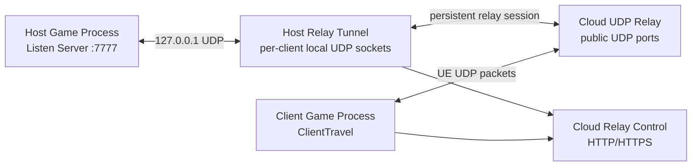

# BattleBlaster 局域网穿透开发者文档

> 版本: v0.1  
> 状态: 技术设计稿，尚未实现  
> 最后更新: 2026-06-09  
> 相关文档: `Docs/08-nat-traversal-prd.md`, `Docs/06-network-mode-developer-guide.md`, `Docs/network-module-implementation-plan.md`

## 1. 设计结论

局域网穿透应作为第三种连接方式接入，不应新增一套玩法规则。

目标连接方式:

```cpp
UENUM(BlueprintType)
enum class EBattleBlasterNetworkConnectionType : uint8
{
	LAN,
	Relay,
	DedicatedServer
};
```

语义:

- `LAN`: 本机 `OpenLevel(Map?listen)`，其他玩家输入 LAN `IP:Port`。
- `Relay`: 本机仍然 `OpenLevel(Map?listen)`，但外网玩家连接云端中转入口，云端把 UDP 游戏包转发到房主本机。
- `DedicatedServer`: 云端运行 UE Dedicated Server，客户端直接连接权威服务器。

`Relay` 和 `LAN` 都是 Listen Server 形态。区别只在连接路径，不在游戏规则。

## 2. 当前工程落点

当前已有关键入口:

- `Source/BattleBlaster/Core/Networking/BattleBlasterNetworkTypes.h`
  - `EBattleBlasterNetworkConnectionType`
  - `ENetworkGameModeType`
  - `FNetworkMatchSettings`
- `Source/BattleBlaster/Core/Networking/BattleBlasterSessionSubsystem.h/.cpp`
  - `HostNetworkGame(const FNetworkMatchSettings& Settings)`
  - `JoinNetworkGame(const FString& Address, int32 Port)`
  - `BuildTravelOptions(const FNetworkMatchSettings& Settings)`
- `Source/BattleBlaster/Modes/Network/UI/Menu/NetworkModeSelectWidget.h/.cpp`
  - 当前 UI 只有 LAN 可用，Server 是规划项。

局域网穿透后续应优先新增独立 Relay 子系统和菜单，而不是把所有逻辑塞进 `UBattleBlasterSessionSubsystem`。

建议分层:

```text
Core/Networking
├─ BattleBlasterNetworkTypes.h
├─ BattleBlasterSessionSubsystem.h/.cpp
├─ BattleBlasterRelayTypes.h              # 新增
├─ BattleBlasterRelaySubsystem.h/.cpp     # 新增
└─ RelayTunnelClient.h/.cpp               # 新增，可先做进程内实现或 sidecar 封装

Modes/Network/UI/Menu
├─ NetworkModeSelectWidget.h/.cpp
├─ LANMenuWidget.h/.cpp
├─ RelayMenuWidget.h/.cpp                 # 新增
├─ RelayHostSettingsWidget.h/.cpp         # 新增
├─ RelayJoinWidget.h/.cpp                 # 新增
└─ ServerMenuWidget.h/.cpp                # 后续 Dedicated Server
```

## 3. 总体架构

首版推荐采用“云端控制面 + UDP 数据面 + 房主本地隧道”的结构。



为什么需要房主本地隧道:

- 房主通常在 NAT 后面，云端不能主动连到房主 `7777`。
- 房主本地隧道主动连云端，可以穿过多数 NAT。
- 隧道再把云端收到的 UE UDP 包转发到本机 `127.0.0.1:7777`。
- 隧道需要为每个远端客户端维护独立本地 UDP 映射，让 UE Listen Server 能区分多个客户端。

不建议首版直接改 UE NetDriver。先用隧道层把现有 `ClientTravel(IP:Port)` 和 `OpenLevel(Map?listen)` 流程保留下来，风险更低。

## 4. 数据路径

### 4.1 Host 创建房间

```text
Host UI
-> Build FNetworkMatchSettings
-> RelaySubsystem.CreateRelayRoom(Settings)
-> Cloud Control: create room
<- roomCode, hostToken, relay endpoints
-> RelayTunnelClient.StartHostTunnel(room)
-> SessionSubsystem.HostNetworkGame(Settings)
-> OpenLevel(Map?listen?...options)
```

注意:

- `FNetworkMatchSettings` 仍然只描述玩法和 Listen Server 参数。
- Relay 房间信息应放在单独的 `FRelayRoomInfo` 或 `FRelayHostSession`。
- `HostNetworkGame()` 进入地图后，Relay 隧道需要继续存活，适合放在 `GameInstanceSubsystem` 或独立进程里。
- 如果 OpenLevel 导致 UI 对象销毁，隧道状态不能依赖 Widget 生命周期。

### 4.2 Client 加入房间

```text
Client UI
-> RelaySubsystem.ResolveRelayRoom(roomCode)
-> Cloud Control: join room
<- client relay endpoint, join token, protocol info
-> SessionSubsystem.JoinNetworkGame(relayIp, relayPort)
-> PlayerController.ClientTravel("relayIp:relayPort")
```

首版可以让加入者直接 `ClientTravel` 到云端分配的 UDP 端口。云端再把该端口收到的 UE UDP 包转发到房主隧道。

### 4.3 UDP 中转

客户端到房主:

```text
Client UE socket
-> Cloud public UDP port
-> Cloud identifies room/client by allocated port
-> Cloud wraps payload as RelayFrame(clientId, payload)
-> HostTunnel
-> HostTunnel sends payload from local socket assigned to clientId
-> 127.0.0.1:7777
-> Host UE Listen Server
```

房主到客户端:

```text
Host UE Listen Server
-> response to 127.0.0.1:clientLocalPort
-> HostTunnel receives on that client's local socket
-> HostTunnel wraps payload as RelayFrame(clientId, payload)
-> Cloud UDP relay
-> Cloud sends raw payload to real client endpoint
-> Client UE socket
```

关键约束:

- 云端不能把多个客户端的包用同一个源端口转给房主 UE，否则 UE 可能把多个远端视为同一个连接。
- 房主本地隧道必须为每个远端客户端创建或复用独立本地 UDP socket。
- 云端发送给客户端时应尽量保持原始 UE payload，不解析游戏内容。

## 5. 云端守护进程

### 5.1 进程职责

云端守护进程建议命名为 `battleblaster-relayd`。

职责:

- 控制面 API。
- 房间码生成和查询。
- Host tunnel 注册和心跳。
- Client join 分配。
- UDP 端口池管理。
- UDP relay 数据转发。
- 限速和资源回收。
- 运行日志和健康检查。

不负责:

- 运行 Unreal Dedicated Server。
- 理解 UE Gameplay。
- 判定胜负。
- 任意端口转发。

### 5.2 推荐模块

```text
battleblaster-relayd
├─ ControlServer
│  ├─ POST /v1/rooms
│  ├─ POST /v1/rooms/{roomCode}/join
│  ├─ POST /v1/rooms/{roomCode}/heartbeat
│  ├─ DELETE /v1/rooms/{roomCode}
│  └─ GET /healthz
├─ RoomRegistry
├─ TokenService
├─ PortAllocator
├─ UdpRelayServer
├─ HostTunnelSession
├─ RateLimiter
└─ MetricsLogger
```

### 5.3 端口规划

建议:

| 用途 | 默认端口 | 协议 | 说明 |
| --- | --- | --- | --- |
| 控制面 | 8080 或 443 | HTTP/HTTPS | 创建房间、加入房间、健康检查 |
| Host 隧道入口 | 7000 | UDP，后续可加 TCP | 房主本地隧道主动连接 |
| Client 中转端口池 | 30000-39999 | UDP | 分配给加入者连接 UE |

开发阶段可以先用 HTTP，正式部署应使用 HTTPS 或反向代理终止 TLS。

云服务器安全组需要开放:

- 控制面端口。
- Host 隧道 UDP 端口。
- Client 中转 UDP 端口池。

不要开放数据库端口或管理端口到公网。

### 5.4 房间数据结构

```text
RelayRoom
├─ roomId
├─ roomCode
├─ protocolVersion
├─ hostTokenHash
├─ createdAt
├─ lastHostHeartbeatAt
├─ expiresAt
├─ maxPlayers
├─ currentClients
├─ matchSettingsSummary
├─ hostTunnelSession
└─ clientAllocations[]
```

```text
ClientAllocation
├─ clientId
├─ joinTokenHash
├─ publicUdpPort
├─ remoteEndpoint
├─ lastPacketAt
├─ bytesIn
├─ bytesOut
└─ state
```

### 5.5 控制面 API 草案

创建房间:

```http
POST /v1/rooms
Content-Type: application/json
```

```json
{
  "protocolVersion": 1,
  "gameVersion": "0.1.0",
  "maxPlayers": 4,
  "modeType": "Deathmatch",
  "mapName": "NetworkBattleTestMap",
  "roomPasswordHash": ""
}
```

响应:

```json
{
  "roomCode": "B7K2Q9",
  "roomId": "uuid",
  "hostToken": "opaque-random-token",
  "relayHost": "203.0.113.10",
  "hostTunnelPort": 7000,
  "expiresInSeconds": 14400
}
```

加入房间:

```http
POST /v1/rooms/B7K2Q9/join
Content-Type: application/json
```

```json
{
  "protocolVersion": 1,
  "gameVersion": "0.1.0",
  "roomPassword": ""
}
```

响应:

```json
{
  "relayHost": "203.0.113.10",
  "relayPort": 30042,
  "clientId": 2,
  "joinToken": "opaque-random-token",
  "expiresInSeconds": 60
}
```

说明:

- `relayPort` 可以是每个加入者独立分配的 UDP 端口。
- 如果客户端直接使用 `ClientTravel(relayHost:relayPort)`，UE 游戏包里不会携带 `joinToken`。此时 `relayPort` 本身必须是短期临时入口，且只能绑定到一个房间和一个 client allocation。
- 如果后续实现客户端本地隧道，则可以在隧道握手里使用 `joinToken` 做更强验证。

### 5.6 Host 隧道协议草案

Host tunnel 主动向云端注册:

```text
HostHello
├─ magic: "BBRT"
├─ protocolVersion
├─ roomId
├─ hostToken
└─ nonce
```

云端响应:

```text
HostWelcome
├─ roomId
├─ heartbeatIntervalMs
└─ maxClients
```

游戏数据帧:

```text
RelayFrame
├─ magic: "BBRF"
├─ protocolVersion
├─ roomId
├─ clientId
├─ sequence
├─ payloadLength
└─ payload: raw UE UDP packet
```

心跳:

```text
Heartbeat
├─ roomId
├─ activeClients
├─ bytesIn
└─ bytesOut
```

首版可以使用简化二进制帧，不需要 JSON 包裹数据面。控制面可用 JSON。

## 6. 本地 Host Tunnel

### 6.1 为什么不直接让云端转发到 Host:7777

房主在 NAT 后，云端无法主动访问房主内网地址。即使房主本机知道 `7777`，云端也没有通向这个端口的入站路径。

因此需要房主主动建立一条外连隧道:

```text
HostTunnel -> CloudRelay
```

云端所有入站客户端包都通过这条隧道回传给房主本机。

### 6.2 进程内还是 Sidecar

有两种实现方式:

| 方式 | 优点 | 缺点 |
| --- | --- | --- |
| 进程内 `RelayTunnelClient` | 打包简单，UI 状态易同步 | 需要处理 UE 生命周期和 socket 线程 |
| 外部 sidecar 小进程 | 与 UE NetDriver 隔离，崩溃影响小，可独立调试 | 打包、启动、回收和日志更复杂 |

建议阶段:

1. 开发验证期可以先做 sidecar，便于快速迭代网络转发。
2. 产品化时再决定是否集成进游戏进程。

### 6.3 本地转发映射

Host tunnel 需要维护:

```text
clientId -> LocalClientSocket
clientId -> CloudRelaySession
LocalClientSocket -> clientId
```

当云端发来某个 `clientId` 的 UE payload:

1. 如果 `clientId` 没有本地 socket，则创建一个 UDP socket。
2. 使用该 socket 把 payload 发送到 `127.0.0.1:ListenPort`。
3. UE Listen Server 会把这个 socket 的本地端口当作远端客户端地址。
4. 该 socket 接收 UE 的响应包。
5. 隧道把响应包封装为 `RelayFrame(clientId, payload)` 发回云端。

这样 UE 看到的是多个不同的 `127.0.0.1:port` 客户端，而不是一个混在一起的转发端口。

### 6.4 Listen Port

默认沿用当前工程的 `7777`。

注意:

- Host tunnel 不应该占用 `7777`。
- `7777` 由 UE Listen Server 使用。
- Host tunnel 使用独立本地 UDP sockets 与 `127.0.0.1:7777` 通信。
- 如果用户在 UI 中修改端口，Relay tunnel 必须读取同一个端口。

## 7. Unreal 集成建议

### 7.1 类型扩展

在后续代码实现阶段，建议新增:

```cpp
UENUM(BlueprintType)
enum class EBattleBlasterNetworkConnectionType : uint8
{
	LAN UMETA(DisplayName = "LAN"),
	Relay UMETA(DisplayName = "Relay"),
	DedicatedServer UMETA(DisplayName = "Dedicated Server")
};
```

新增 Relay 数据:

```cpp
USTRUCT(BlueprintType)
struct FRelayRoomInfo
{
	GENERATED_BODY()

	UPROPERTY(BlueprintReadOnly)
	FString RoomCode;

	UPROPERTY(BlueprintReadOnly)
	FString RelayHost;

	UPROPERTY(BlueprintReadOnly)
	int32 RelayPort = 0;

	UPROPERTY(BlueprintReadOnly)
	FString RoomId;

	UPROPERTY(BlueprintReadOnly)
	int32 ExpiresInSeconds = 0;
};
```

```cpp
USTRUCT(BlueprintType)
struct FRelayJoinResult
{
	GENERATED_BODY()

	UPROPERTY(BlueprintReadOnly)
	bool bSuccess = false;

	UPROPERTY(BlueprintReadOnly)
	FText ErrorMessage;

	UPROPERTY(BlueprintReadOnly)
	FString RelayHost;

	UPROPERTY(BlueprintReadOnly)
	int32 RelayPort = 0;
};
```

### 7.2 Subsystem 分工

`UBattleBlasterSessionSubsystem` 继续负责:

- 构建 travel options。
- LAN Host。
- LAN/IP Join。
- 最终 `OpenLevel` / `ClientTravel`。

新增 `UBattleBlasterRelaySubsystem` 负责:

- 创建 Relay 房间。
- 加入 Relay 房间。
- 管理房主隧道生命周期。
- 上报 Relay 状态给 UI。
- 把 Relay join 结果转换为 `JoinNetworkGame(RelayHost, RelayPort)`。

不要让 Widget 直接拼 HTTP 请求或直接管理 UDP socket。

### 7.3 UI 类建议

网络模式选择页:

```text
UNetworkModeSelectWidget
├─ LANButton
├─ RelayButton
├─ ServerButton
└─ BackButton
```

Relay 菜单:

```text
URelayMenuWidget
├─ HostButton
├─ JoinButton
└─ BackButton
```

Relay Host:

```text
URelayHostSettingsWidget
├─ 玩法设置，与 LANHostSettingsWidget 类似
├─ RelayServerAddress
├─ RoomPassword optional
├─ StartRelayHostButton
├─ RoomCodeText
├─ RelayStatusText
└─ BackButton
```

Relay Join:

```text
URelayJoinWidget
├─ RoomCodeTextBox
├─ RoomPasswordTextBox optional
├─ JoinButton
├─ StatusText
└─ BackButton
```

可以复用 LAN Host 的玩法设置控件，但建议抽出共享基类或共享 helper，而不是让 Relay Host 继承 LAN Host 的文案和行为。

## 8. 与现有 Network GameMode 的关系

局域网穿透进入地图后，仍然使用:

- `ANetworkDeathmatchGameMode`
- `ANetworkTeamDeathmatchGameMode`
- `ANetworkMOBAGameMode`
- `ANetworkTeamMOBAGameMode`

这些类不需要知道连接来自 LAN 还是 Relay。它们只关心:

- 玩家登录。
- SlotId / TeamId。
- Spawn。
- 输入 RPC。
- Projectile / Health / Buff 复制。
- 死亡、复活、计分、结算。

除非后续要在 UI 中显示 Relay 质量，否则对局规则层不应引用 Relay subsystem。

## 9. Dedicated Server 的边界

不要把 Relay 当成 Dedicated Server。

| 维度 | Relay | Dedicated Server |
| --- | --- | --- |
| UE GameMode 运行位置 | 房主本机 | 云服务器 |
| 云端是否理解游戏规则 | 否 | 是 |
| 房主退出后对局是否存在 | 否 | 可以存在 |
| 公平性 | 依赖房主 | 更强 |
| 云端资源消耗 | 带宽为主 | CPU、内存、带宽都更高 |
| 适用场景 | 好友房、轻量外网联机 | 长期开服、正式服务器 |

因此网络入口应长期保持三分:

```text
LAN direct
Relay listen server
Dedicated authoritative server
```

## 10. 部署建议

### 10.1 云服务器目录

建议:

```text
/opt/battleblaster-relay/
├─ battleblaster-relayd
├─ config.yaml
├─ logs/
└─ data/
```

`data/` 首版可以为空或只放运行状态，不依赖数据库。

### 10.2 配置草案

```yaml
server:
  public_host: "YOUR_PUBLIC_IP_OR_DOMAIN"
  control_bind: "0.0.0.0:8080"
  host_tunnel_udp_bind: "0.0.0.0:7000"

relay:
  client_udp_port_start: 30000
  client_udp_port_end: 39999
  room_ttl_seconds: 14400
  empty_room_ttl_seconds: 600
  host_heartbeat_timeout_seconds: 15
  max_rooms: 64
  max_clients_per_room: 8
  max_packet_bytes: 1500
  per_client_rate_limit_kbps: 512

security:
  room_code_length: 6
  token_bytes: 32
  require_room_password: false

logging:
  level: "info"
  file: "/opt/battleblaster-relay/logs/relayd.log"
```

### 10.3 Linux systemd 示例

```ini
[Unit]
Description=BattleBlaster Relay Daemon
After=network-online.target
Wants=network-online.target

[Service]
Type=simple
WorkingDirectory=/opt/battleblaster-relay
ExecStart=/opt/battleblaster-relay/battleblaster-relayd --config /opt/battleblaster-relay/config.yaml
Restart=always
RestartSec=3
User=battleblaster
NoNewPrivileges=true

[Install]
WantedBy=multi-user.target
```

### 10.4 防火墙

示例端口:

```text
TCP 8080 or TCP 443
UDP 7000
UDP 30000-39999
```

如果云服务器带宽较小，可以先把 UDP 端口池缩小，例如 `30000-30100`。

## 11. 可靠性策略

### 11.1 心跳

Host tunnel 每 2 到 5 秒发送一次心跳。

云端规则:

- 超过 `host_heartbeat_timeout_seconds` 未收到心跳，房间标记为 Closing。
- 回收所有 client allocations。
- 释放 UDP 端口。

客户端规则:

- 加入失败时返回 Relay Join UI。
- 对局中断线后沿用现有网络断线处理，后续可补专门提示。

### 11.2 超时

建议超时:

| 项 | 建议值 |
| --- | --- |
| Join token TTL | 60 秒 |
| 未连接 Host tunnel 的房间 TTL | 30 秒 |
| 空房间 TTL | 10 分钟 |
| 最大房间生命周期 | 4 小时 |
| Client UDP allocation idle TTL | 60 秒 |

### 11.3 日志

日志应记录:

- room created / closed / expired。
- host tunnel connected / disconnected。
- client allocation created / expired。
- port allocation failure。
- rate limit triggered。
- protocol version mismatch。

日志不应记录:

- 原始 UE 游戏包内容。
- 房间密码明文。
- token 明文。

## 12. 测试计划

### 12.1 本机测试

目标:

- Relay daemon 在本机启动。
- Host game 创建 Relay 房间。
- Client game 通过 `127.0.0.1:relayPort` 加入。
- 验证 tunnel 多 client 映射。

注意:

- 本机测试不能代表 NAT 穿透成功，只能验证转发逻辑。

### 12.2 局域网测试

目标:

- 云端 relayd 部署在公网服务器。
- 房主和客户端在同一 LAN 但通过 Relay 加入。
- 验证 Relay 路径不依赖 LAN IP。

### 12.3 跨网络测试

目标:

- 房主在家庭网络。
- 客户端在手机热点或另一套宽带。
- 不配置路由器端口转发。
- 通过房间码加入成功。

最低验收玩法:

- Deathmatch: 移动、开火、命中、死亡、复活、计分、结算。
- TeamDeathmatch: 队伍分配、友伤过滤、团队分数。
- MOBA: Turret / Core 状态同步。

### 12.4 压测

需要测:

- 单客户端上行/下行带宽。
- 2 人、4 人、8 人房间带宽。
- relayd CPU 和内存。
- 丢包情况下的表现。
- 房间异常关闭后的资源回收。

压测结论应反推:

- 默认最大房间数。
- 默认最大玩家数。
- 每客户端限速值。
- 云服务器带宽是否需要升级。

## 13. 分阶段实现路线

### 阶段 0: 文档和协议确认

- 确认本文的 Relay 架构。
- 确认 UI 中三入口命名。
- 确认云服务器操作系统、开放端口和公网带宽。

### 阶段 1: 最小 relayd 原型

- 实现控制面健康检查。
- 实现创建房间和加入房间。
- 实现 UDP 端口分配。
- 实现单房间单客户端转发。
- 使用外部 sidecar 或命令行 tunnel 验证 Host Listen Server。

### 阶段 2: 多客户端和生命周期

- 实现 per-client 本地 UDP socket 映射。
- 实现心跳、TTL、房间关闭。
- 实现基础限速。
- 支持 2 到 4 名客户端加入同一房间。

### 阶段 3: UE 菜单集成

- 新增 `Relay` connection type。
- 新增 `UBattleBlasterRelaySubsystem`。
- 新增 Relay Host / Join UI。
- 创建房间后自动启动 tunnel 并 HostNetworkGame。
- 加入房间后自动 ClientTravel 到中转端点。

### 阶段 4: 云端部署

- 打包 relayd。
- 写 systemd 服务。
- 配置防火墙和端口池。
- 建立日志轮转。
- 做跨网络验收。

### 阶段 5: 产品化增强

- HTTPS 控制面。
- 房间密码。
- 更好的错误提示。
- 连接质量显示。
- TCP/WebSocket 兜底。
- NAT 类型检测和直连优化。

## 14. 实现注意事项

- 不要在 Relay 模式中复制一套 Network GameMode。
- 不要让云端 relayd 解析 UE gameplay packet。
- 不要把 Relay 房间做成永久服务器列表。
- 不要开放任意 UDP 转发。
- 不要让 Widget 持有唯一隧道状态。
- 不要让 Host tunnel 占用 UE Listen Port。
- 不要假设所有客户端包都来自不同公网 IP，同一 NAT 下多个客户端可能共享 IP。
- 不要假设 UDP 一定可用，首版可以失败并提示，后续再做 TCP 兜底。

## 15. 开放问题

- 云服务器公网带宽是多少，是否按流量计费。
- 首版是否接受开发阶段 sidecar 进程。
- 房间是否需要密码。
- 是否要支持仅输入 `RelayIP:Port` 的开发者调试入口。
- Relay daemon 使用 C++、Go、Rust 还是 Node.js 实现。
- 是否需要为中国大陆网络准备域名和 HTTPS 证书。

